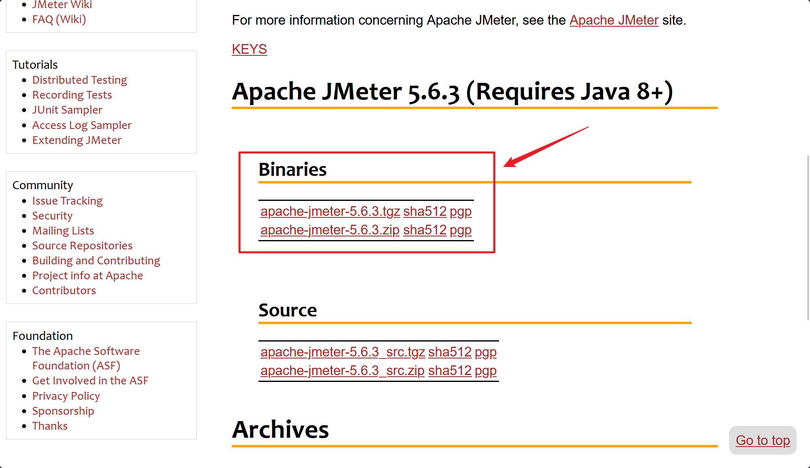
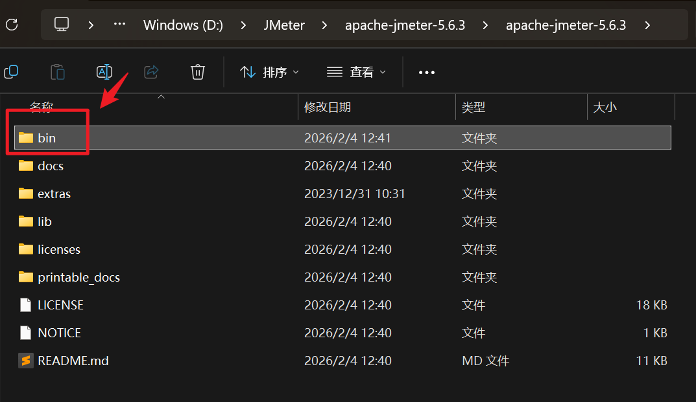
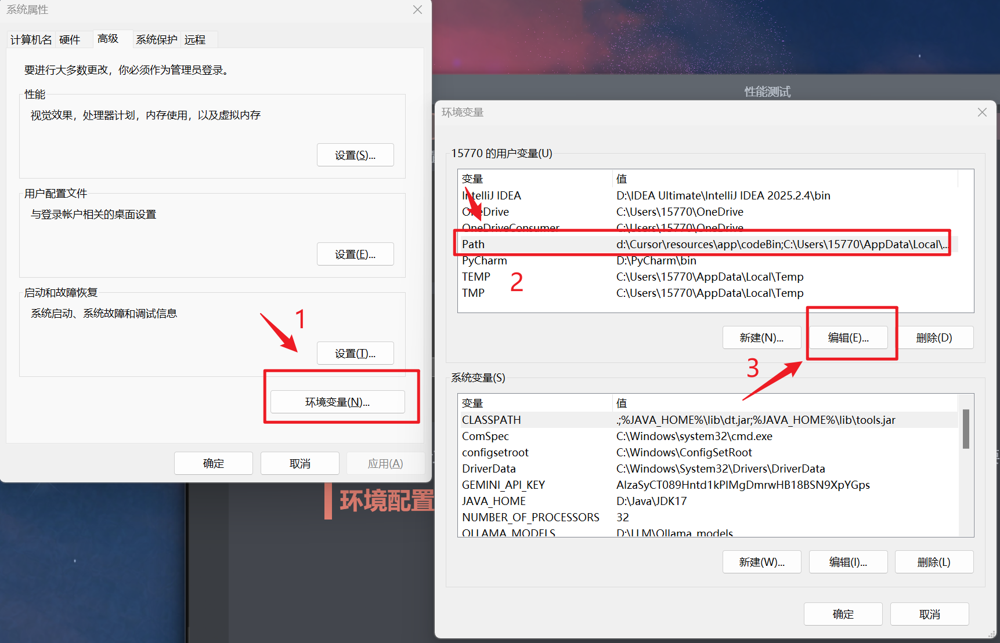
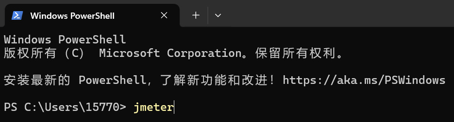
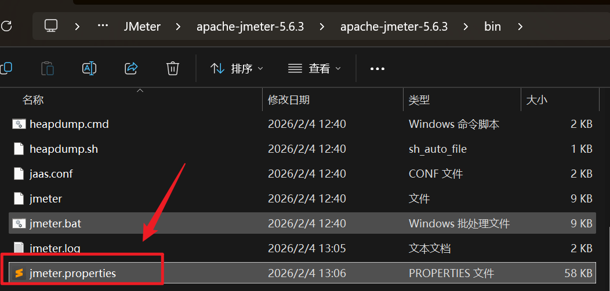
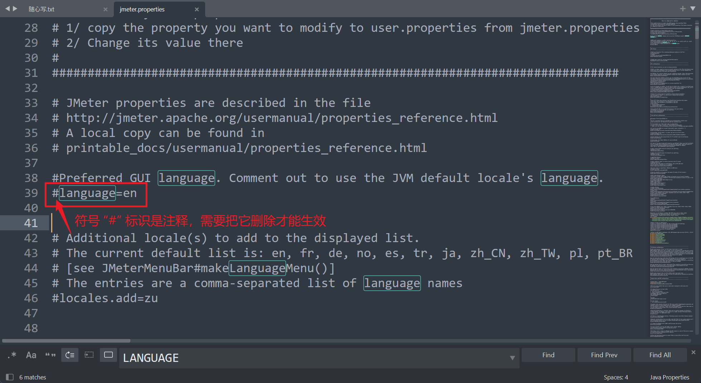

+++
date = '2026-02-04T14:36:41+08:00'
draft = true
title = '🎁 Jmeter 安装配置'
+++
# 性能测试

掌握性能测试工具是自动化测试中必备的技能，有助于提高效率

# JMeter配置

## 下载安装

JMeter官网[jmeter.apache.org/download_jmeter.cgi](https://jmeter.apache.org/download_jmeter.cgi)，点击Binary一栏，注意要求JDK为8及以上，选择任意解压包，下载后解压

---

cd到你解压后的文件位置，访问bin文件找到jmeter.bat双击即可打开

每次打开JMeter工具都需要找到文件夹非常麻烦，我们可以配置到环境变量中，这样每次启动只需要在控制台输入jmeter即可快速打开~

---

## 环境配置

搜索“环境变量”，在Path中新增你的JMeter所在的文件夹的bin文件路径

以我的放在D盘的JMeter文件夹为例

在终端输入关键词`jmeter`即可快速打开

---

## 中文配置

首次打开JMeter工具界面默认为英文，我们需要在JMeter的bin目录下，修改它的配置文件`properties`​，找到`language`​一栏，修改为`zh_CN`​，<u>**如果有注释 # 需要把它去掉，后面不要留有空格！**</u> 修改后 ctrl + s 保存，重启JMeter即可

​​

‍
