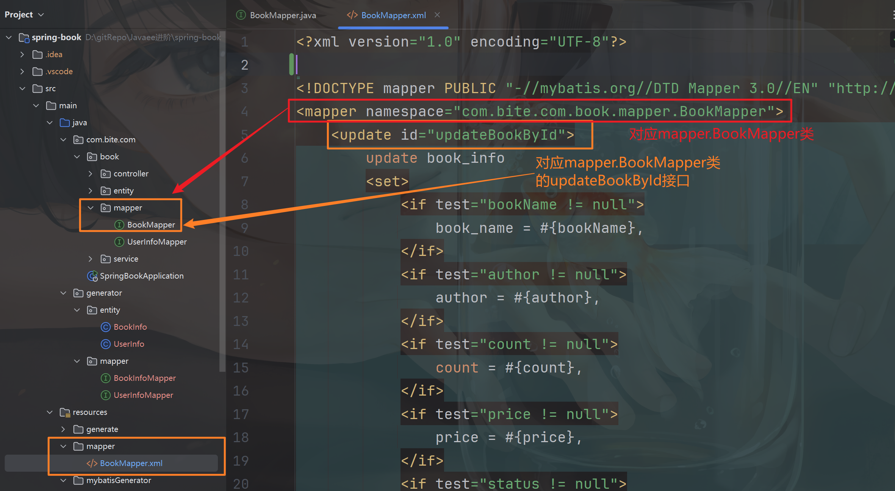
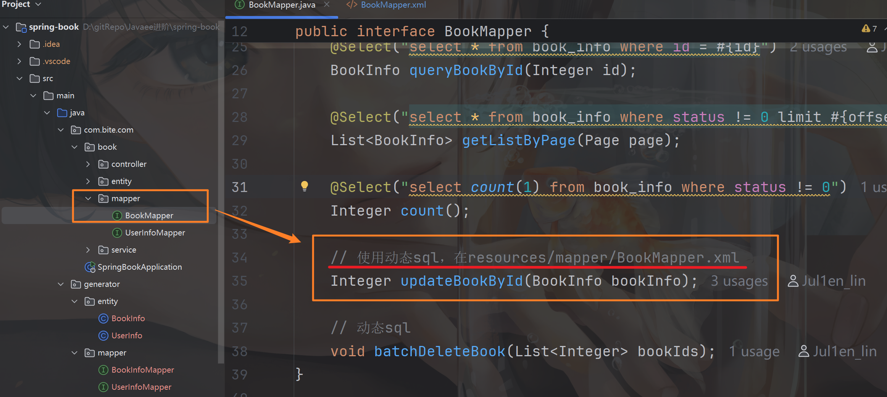
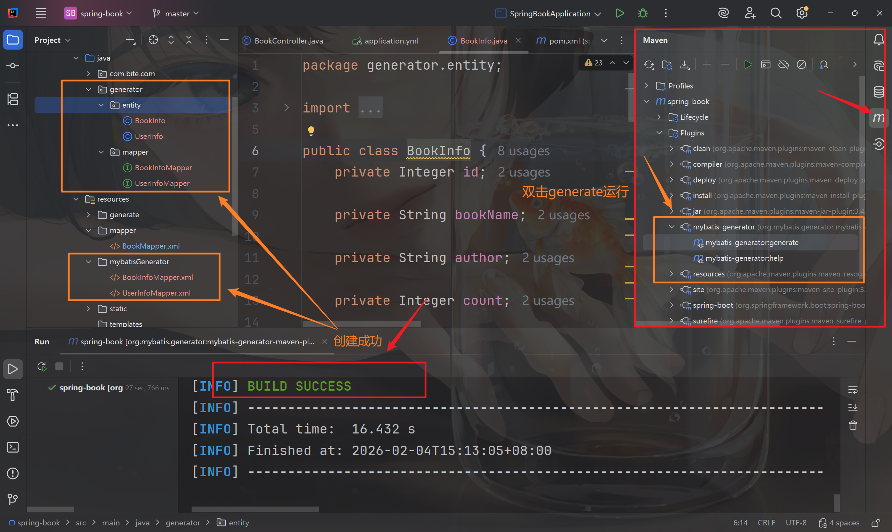
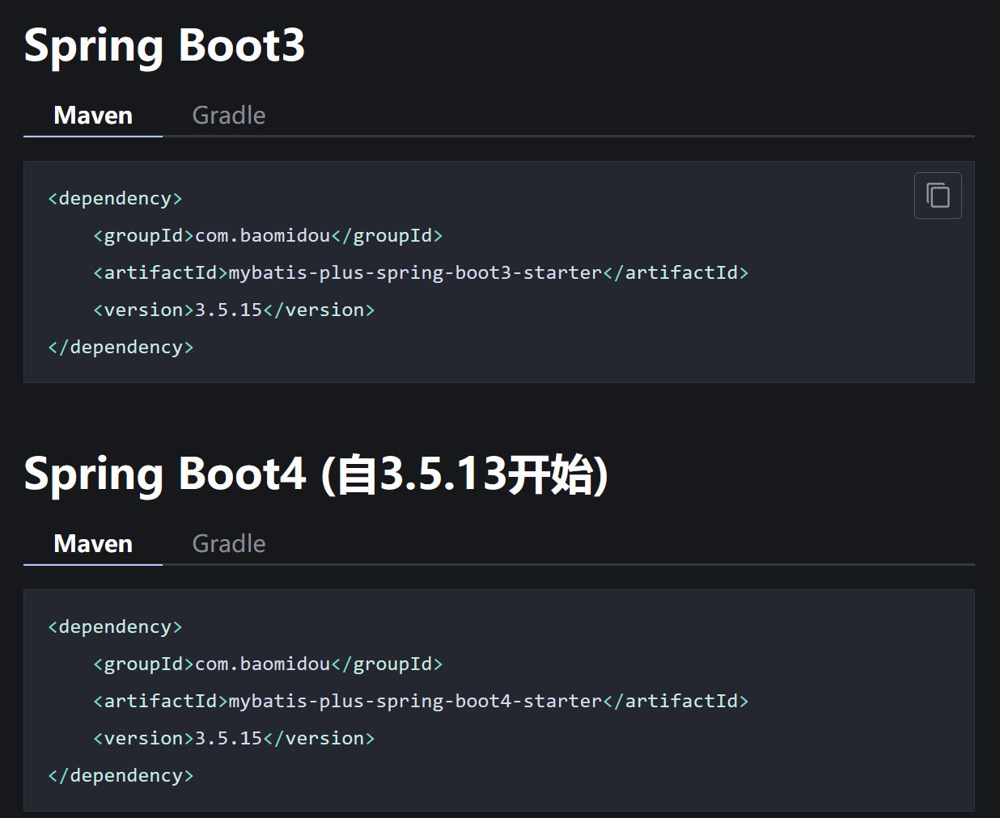
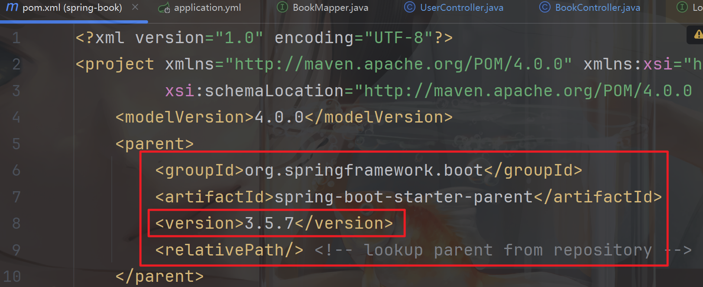
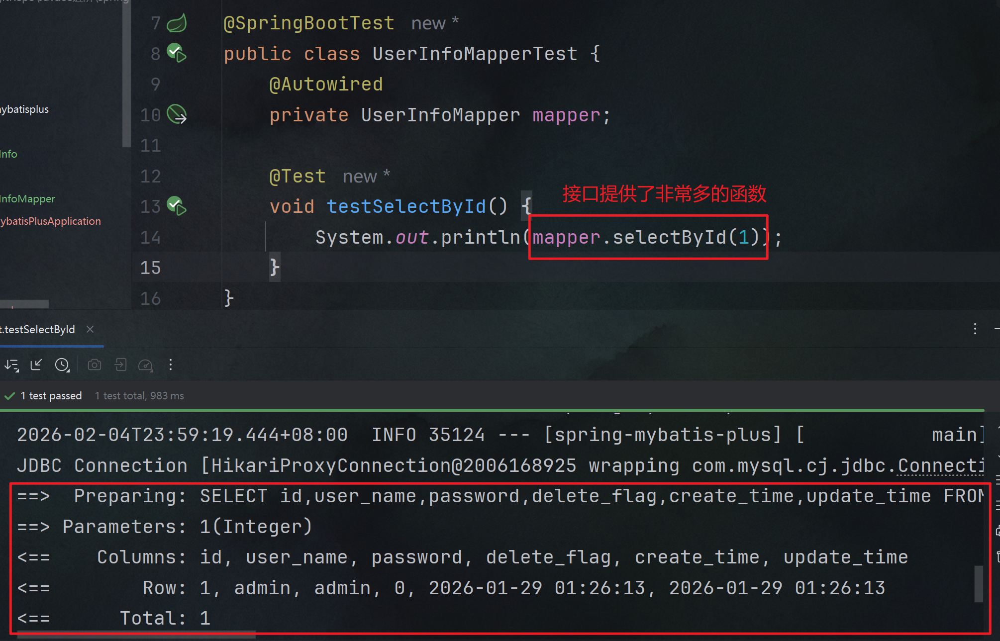
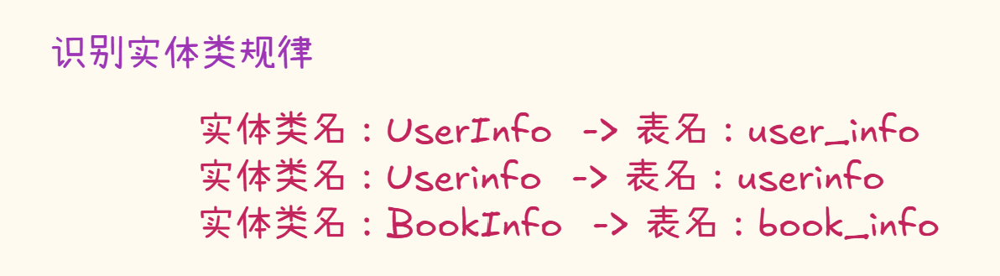
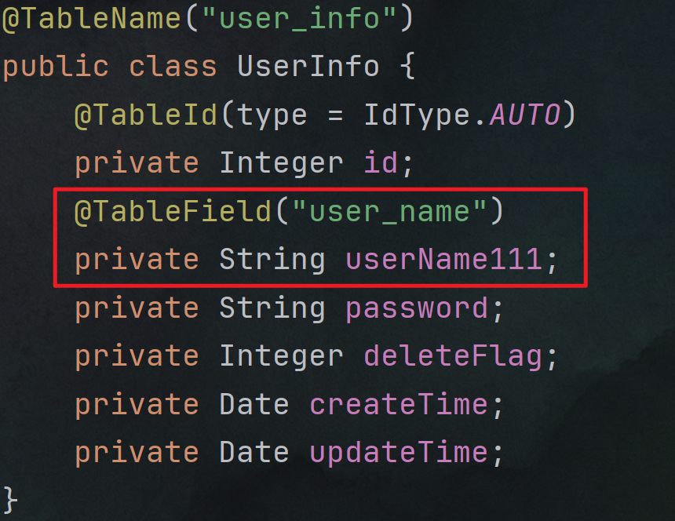

# MyBatis

MyBatis 是一款半自动对象关系映射持久层框架，其核心通过 XML 或注解实现原生 SQL 与 Java 对象的解耦映射，在消除冗余 JDBC 代码的同时，保留了对 SQL 执行逻辑的控制

接下来先讲传统Mybatis的配置

# MyBatis配置

mybatis是IDE和数据库的桥梁，便于在后端也能执行SQL，故配置必须需要连接数据库~

💫`application.yml`配置💫必备

```java
# 数据库连接配置
spring:
  datasource:
    url: jdbc:mysql://127.0.0.1:3306/book_test?characterEncoding=utf8&useSSL=false&allowPublicKeyRetrieval=true
    username: root
    password: root
    driver-class-name: com.mysql.cj.jdbc.Driver
mybatis:
  configuration:
    map-underscore-to-camel-case: true #配置驼峰自动转换
    log-impl: org.apache.ibatis.logging.stdout.StdOutImpl #打印sql语句
# 设置日志文件的文件名
logging:
  file:
    name: spring-book.log
```

## MyBatis

### yml配置

在`application.yml`中可以增加mybatis的相关配置，如配置驼峰自动转换

```java
mybatis:
  configuration:
    map-underscore-to-camel-case: true #配置驼峰自动转换
    log-impl: org.apache.ibatis.logging.stdout.StdOutImpl #打印sql语句
```

### 添加依赖

```java
		<dependency>
            <groupId>org.mybatis.spring.boot</groupId>
            <artifactId>mybatis-spring-boot-starter</artifactId>
            <version>3.0.5</version>
        </dependency>
        <dependency>
            <groupId>com.mysql</groupId>
            <artifactId>mysql-connector-j</artifactId>
            <scope>runtime</scope>
        </dependency>
```

### xml配置（动态SQL）

xml一般是在写SQL中，简单的SQL已经无法满足业务需求，需要动态SQL时，需要的mybatis的配置，动态SQL就在xml文件里写。

一般放在resources.mapper包下，命名规范为`xxxMapper.xml`，对应某个类。效果和注解Spring的@Select、@Update注解作用一致

```java
<!--将以下放到xml文件头-->

<?xml version="1.0" encoding="UTF-8"?>
<!DOCTYPE mapper PUBLIC "-//mybatis.org//DTD Mapper 3.0//EN" "http://mybatis.org/dtd/mybatis-3-mapper.dtd">
<mapper namespace="com.bite.com.book.mapper.BookMapper">
		<!--namespace为对应mapper包的某个类所在位置，位置可修改，如下-->
</mapper>
```





## MyBatisX

是一款plugin，支持xml的快速跳转和生成代码，非常好用~


## MyBatis-Generator插件

这个插件使用也是非常的广泛

手写mapper还是太麻烦了，有一些插件能够帮我们自动生成一些sql，提高效率，同时需要generator文件

```java
<plugin>
	<groupId>org.mybatis.generator</groupId>
	<artifactId>mybatis-generator-maven-plugin</artifactId>
	<version>1.3.6</version>
	<executions>
		<execution>
			<id>Generate MyBatis Artifacts</id>
			<phase>deploy</phase>
			<goals>
				<goal>generate</goal>
			</goals>
		</execution>
	</executions>
	<configuration>
		<!--generator.xml配置文件所在位置，位置可修改-->
		<configurationFile>src/main/resources/generate/generator.xml</configurationFile>
		<!-- 允许覆盖生成的文件, mapxml不会覆盖, 采用追加的方式-->
		<overwrite>true</overwrite>
		<verbose>true</verbose>
		<!--将当前pom的依赖项添加到生成器的类路径中-->
		<includeCompileDependencies>true</includeCompileDependencies>
	</configuration>
	<dependencies>
		<dependency>
			<groupId>mysql</groupId>
			<artifactId>mysql-connector-java</artifactId>
			<version>8.0.33</version>
		</dependency>
	</dependencies>
</plugin>
```

上述插件提到的文件[generator.xml](assets/generator-20260204145109-vh72myh.xml)，需放所提到的`<configurationFile>`​对应的位置，**位置可修改**


​`generator.xml`文件内容如下，一些配置项需要修改，如数据库连接信息

```java
<?xml version="1.0" encoding="UTF-8"?>
<!DOCTYPE generatorConfiguration
        PUBLIC "-//mybatis.org//DTD MyBatis Generator Configuration 1.0//EN"
        "http://mybatis.org/dtd/mybatis-generator-config_1_0.dtd">
<!-- 配置生成器 -->
<generatorConfiguration>

    <!-- 一个数据库一个context -->
	<!-- targetRuntime中可修改为MyBatis3，MyBatis3simple生成简单的SQL，选择MyBatis3，SQL更全面 -->
    <context id="MysqlTables" targetRuntime="MyBatis3Simple" defaultModelType="flat">
        <!--去除注释-->
        <commentGenerator>
            <property name="suppressDate" value="true"/>
            <property name="suppressAllComments" value="true" />
        </commentGenerator>

        <!--数据库链接信息，URL需要配置，如端口号，ip，数据表名，要求与application.yml的spring数据库保持一致-->
        <jdbcConnection driverClass="com.mysql.jdbc.Driver"
                        connectionURL="jdbc:mysql://127.0.0.1:3306/java_blog_spring?serverTimezone=Asia/Shanghai&amp;nullCatalogMeansCurrent=true"
                        userId="root"
                        password="root">
        </jdbcConnection>
		
		<!-- 以下实体类都可手动指定生成文件位置，位置为targetPackage-->
        <!-- 生成实体类 -->
        <javaModelGenerator targetPackage="generator.entity" targetProject="src/main/java" >
            <property name="enableSubPackages" value="false"/>
            <property name="trimStrings" value="true"/>
        </javaModelGenerator>
        <!-- 生成mapxml文件 -->
        <sqlMapGenerator targetPackage="mybatisGenerator" targetProject="src/main/resources" >
            <property name="enableSubPackages" value="false" />
        </sqlMapGenerator>
        <!-- 生成mapxml对应client，也就是接口dao -->
        <javaClientGenerator targetPackage="generator.mapper" targetProject="src/main/java" type="XMLMAPPER" >
            <property name="enableSubPackages" value="false" />
        </javaClientGenerator>
        <!-- table可以有多个,每个数据库中的表都可以写一个table，tableName表示要匹配的数据库表,也可以在tableName属性中通过使用%通配符来匹配所有数据库表,只有匹配的表才会自动生成文件 -->
        <table tableName="user_info">
            <property name="useActualColumnNames" value="false" />
            <!-- 对应数据库表的主键 -->
            <generatedKey column="id" sqlStatement="Mysql" identity="true" />
        </table>
    </context>
</generatorConfiguration>

```

配置完成，**双击运行插件即可，配置文件**​**​`generator.xml`​**就会生成对应的实体类与xml文件



### 注意

​`generator.xml`文件头放到IDE上会出现报错，无需更改


---

# 🚩MyBatis-plus

是一个MyBatis的增强工具，简化开发，提高效率，类似于Hutool工具包，使用时仅需导入依赖即可

它封装了许多SQL语句，使用时仅需让mapper类`extends BaseMapper<>`父类接口，执行时则可以直接调用他的一系列函数，无需手写

## 配置

### 引入依赖

参考官方文档[https://baomidou.com/getting-started](https://baomidou.com/getting-started/)



```java
<!--Spring Boot3-->
<dependency>
    <groupId>com.baomidou</groupId>
    <artifactId>mybatis-plus-spring-boot3-starter</artifactId>
    <version>3.5.15</version>
</dependency>

<!--Spring Boot4-->
<dependency>
    <groupId>com.baomidou</groupId>
    <artifactId>mybatis-plus-spring-boot4-starter</artifactId>
    <version>3.5.15</version>
</dependency>
```

根据你现使用的SpringBoot版本选择对应的依赖~



### 编码

1. 编写对应实体类
2. 编写 Mapper 接口并拓展`BaseMapper<T>`接口

完成简单两步即可实现内部丰富的函数




### 打印执行SQL日志

与mybatis的配置文件类似，只需把名字改为mybatis-plus

​`application.yml`

```java
mybatis-plus:
  configuration:
    map-underscore-to-camel-case: true #配置驼峰自动转换
    log-impl: org.apache.ibatis.logging.stdout.StdOutImpl #打印sql语句
```

## 识别原理

刚才只是配置了`application.yml`​中的数据库连接信息，拓展了`BaseMapper<>`​接口与实现了一个实体类`UserInfo`​，就能够查询数据库中的`user_info`这张表并且成功执行SQL了，它是如何识别出来的呢？

1. 表名

是根据实体类名推断的，如果不一致，使用`@TableName`注解映射实体类对应的表名是哪个




2. id 是否有自增


执行**insert**操作时，表的id是自增主键，理想情况下ID应自增为3。但是ID一栏mybatis生成了随机数字，扰乱了原本的自增主键

这是由于mybatis不能自动识别表中是否有自增，哪一个是自增主键，用到注释`@TableId`映射，它定义主键及其主键的性质（自增、输入，无性质）


使用注解标识后就能很好的解决这个问题了


查看源码，主键性质分为如下几类


3. 字段与属性的映射关系

他的推断规律与推断表名是一样的，如果不一致则用`@TableField`映射



## 条件构造器Wrapper

MyBatis-Plus 提供了一套强大的条件构造器（Wrapper），用于构建复杂的数据库查询条件。Wrapper 类允许开发者以链式调用的方式构造查询条件，无需编写繁琐的 SQL 语句，从而提高开发效率并减少 SQL 注入的风险

它是构建复杂查询和更新条件的关键工具。**它允许开发者以链式调用的方式构造 SQL 的 WHERE 子句，提供了极大的灵活性和便利性**

MyBatis-Plus 关于构造器的官方参考文档：[https://baomidou.com/guides/wrapper](https://baomidou.com/guides/wrapper)

- **AbstractWrapper**：这是一个抽象基类，提供了所有 Wrapper  类共有的方法和属性。它定义了条件构造的基本逻辑，包括字段（column）、值（value）、操作符（condition）等。**<u>所有的  QueryWrapper、UpdateWrapper、LambdaQueryWrapper 和 LambdaUpdateWrapper 都继承自 AbstractWrapper</u>**
- **QueryWrapper**：专门用于构造查询条件，支持基本的等于、不等于、大于、小于等各种常见操作。它允许你以链式调用的方式添加多个查询条件，并且可以组合使用 `and`​ 和 `or` 逻辑
- **UpdateWrapper**：用于构造更新条件，可以在更新数据时指定条件。与 QueryWrapper 类似，它也支持链式调用和逻辑组合。使用 UpdateWrapper 可以在不创建实体对象的情况下，直接设置更新字段和条件
- **LambdaQueryWrapper +**  **LambdaUpdateWrapper**

  LambdaWrapper类：**<u>这是一个基于 Lambda 表达式的查询条件构造器，它通过 Lambda 表达式来引用实体类的属性，从而避免了硬编码字段名。提高了代码的可读性和可维护性，尤其是在字段名可能发生变化的情况下</u>**

Wrapper类提供了许多SQL关键词，允许你以链式调用的方式添加多个查询条件，对此分类讨论

1. 基础比较算子

   - ​**eq**​：等于（`=`）
   - ​**ne**​：不等于（`<>`）
   - ​**gt / ge**​：大于（`>`​） / 大于等于（`>=`）
   - ​**lt / le**​：小于（`<`​） / 小于等于（`<=`）
   - **allEq**：全等于，通常接收 `Map` 进行多字段精确匹配

2. **区间与集合筛选**

   - **between / notBetween**：值在指定范围内（`BETWEEN ... AND ...`）
   - **in / notIn**：值在指定的集合、数组或子查询结果中（`IN (...)`）
   - **inSql / notInSql**：通过原生的 SQL 子查询实现集合筛选

3. **文本模式处理**

   - **like / notLike**：模糊匹配，生成的 SQL 默认为 `%值%`
   - **likeLeft / likeRight**：左模糊（`%值`​）与右模糊（`值%`​）。注意：在 B+ 树索引中，`likeRight`​ 可能维持索引有效，而 `likeLeft` 会导致全表扫描

4. 空值与逻辑判定

   - **isNull / isNotNull**：字段是否为 `NULL`
   - **exists / notExists**：拼接 `EXISTS (subquery)` 逻辑
   - **and / or**：逻辑连接符，MyBatis-Plus 默认以 `AND`​ 拼接。若要实现 `(A OR B)` 这种嵌套逻辑，需在方法中传入 Lambda 表达式

5. 排序、分组与结果控制

   - **select**：指定投影查询的字段，实现按需取数
   - **groupBy / having**：对应 SQL 的分组聚合逻辑
   - **orderByAsc / orderByDesc**：指定升序或降序排列
   - **last**：直接在 SQL 末尾追加字符串（如 `LIMIT`​ 或 `FOR UPDATE`），无视所有规则且存在注入风险

6. 动态 SQL 与高级拼接

   - **apply**：用于拼接原生的 SQL 片段，支持通过 `{index}` 方式进行预编译参数绑定，防止 SQL 注入
   - **nested**：不带 `AND`​ 或 `OR` 的原生嵌套括号

### 代码示例

以id为自增主键的用户表名举例

用户实体类

```java
@Data
@TableName("user_info")
public class UserInfo {
    @TableId(type = IdType.AUTO)
    private Integer id;
    @TableField("user_name")
    private String userName;
    private String password;
    private Integer deleteFlag;
    private Date createTime;
    private Date updateTime;
}
```

Mapper类

```java
@Mapper
public interface UserInfoMapper extends BaseMapper<UserInfo> {
    // 注解构造SQL
    @Select("select id,username,password,age FROM userinfo WHERE username = #{userName}")
    List<UserInfo> queryUserInfoList(String userName);

    // Wrapper对象传参构造SQL
    @Select("select id,username,password,age FROM userinfo ${ew.customSqlSegment}")
    List<UserInfo> queryUserInfoList2(@Param(Constants.WRAPPER) QueryWrapper wrapper);

    // xml + Wrapper 构造SQL
	// xml内容：
    //	<select id="queryUserInfoList3">
    //    select id,username,password,age FROM userinfo ${ew.customSqlSegment}
    //	</select>
    List<UserInfo> queryUserInfoList3(@Param(Constants.WRAPPER) QueryWrapper wrapper);

    // 参数 + Wrapper 构造SQL
    @Update("update userinfo set age = age+ #{addAge} ${ew.customSqlSegment}")
    Integer updateUserInfoByCustomSql(@Param("addAge") Integer addAge, @Param(Constants.WRAPPER) QueryWrapper wrapper);

}
```

**Wrapper类（示例）**

```java
@SpringBootTest
public class UserInfoMapperTest {
    @Autowired
    private UserInfoMapper userInfoMapper;

    /**
     * select id,username,password,age FROM userinfo where userName like %min%
     */
    @Test
    void queryUserInfoList2() {
        QueryWrapper<UserInfo> queryWrapper = new QueryWrapper<>();
        queryWrapper.like("userName","min");

        List<UserInfo> userInfos = userInfoMapper.queryUserInfoList2(queryWrapper);
        System.out.println(userInfos);
    }

    @Test
    void queryUserInfoList3() {
        QueryWrapper<UserInfo> queryWrapper = new QueryWrapper<>();
        queryWrapper.like("userName","min");

        List<UserInfo> userInfos = userInfoMapper.queryUserInfoList3(queryWrapper);
        System.out.println(userInfos);
    }

    /**
     * update userinfo set age = age+ 10 where id in (1, 2, 3))
     */
    @Test
    void updateUserInfoByCustomSql() {
        QueryWrapper<UserInfo> queryWrapper = new QueryWrapper<>();
        queryWrapper.in("id",List.of(1,2,3));

        userInfoMapper.updateUserInfoByCustomSql(10,queryWrapper);
    }

    /**
     * select id,username,password from user_info where age = 18 and username like %min%
     * userInfoMapper 调用BaseMapper的selectList方法
     */
    @Test
    void testQueryWrapper(){
        QueryWrapper<UserInfo> queryWrapper = new QueryWrapper<>();
        queryWrapper.select("id","username","password").eq("age",18)
                .like("username","min");

        List<UserInfo> userInfos = userInfoMapper.selectList(queryWrapper);
        System.out.println(userInfos);
    }

    /**
     * delete from user_info where age = 18
     */
    @Test
    void testQueryWrapper2(){
        QueryWrapper<UserInfo> userInfoQueryWrapper = new QueryWrapper<>();
        userInfoQueryWrapper.eq("age", 18);

        int num = userInfoMapper.delete(userInfoQueryWrapper);
        System.out.println(num);
    }

    /**
     * QueryWrapper
     * update user_info set delete_flag = 1 where age < 20
     */
    @Test
    void testQueryWrapper3(){
        QueryWrapper<UserInfo> queryWrapper = new QueryWrapper<>();
        queryWrapper.lt("age",20); // where age < 20
        // 更新对象
        UserInfo userInfo = new UserInfo();
        userInfo.setDeleteFlag(1);

        int update = userInfoMapper.update(userInfo, queryWrapper);
        System.out.println(update);
    }

    /**
     * UpdateWrapper
     * update user_info set delete_flag = 0 where age < 20
     */
    @Test
    void testUpdateWrapper(){
        UpdateWrapper<UserInfo> updateWrapper = new UpdateWrapper<>();
        updateWrapper.set("delete_flag",0).lt("age",20);

        int update = userInfoMapper.update(updateWrapper);
        System.out.println(update);
    }

    /**
     * update user_info set delete_flag = 1,age = 5 where id in (2,3,5,6)
     */
    @Test
    void testUpdateWrapper2(){
        UpdateWrapper<UserInfo> updateWrapper = new UpdateWrapper<>();
        updateWrapper.set("delete_flag", 1).set("age", 5)
                .in("id", List.of(2, 3, 5, 6));

        int num = userInfoMapper.update(updateWrapper);
        System.out.println(num);
    }

    /**
     * update user_info set age = age + 10 where id in (2,3,5,6)
     */
    @Test
    void testUpdateWrapper3(){
        UpdateWrapper<UserInfo> updateWrapper = new UpdateWrapper<>();
        updateWrapper.setSql("age = age +10")
                .in("id", List.of(2, 3, 5, 6));

        int num = userInfoMapper.update(updateWrapper);
        System.out.println(num);
    }

    /**
     * LambdaQueryWrapper
     * select id,username,password from user_info where id = 10 and username like %min%
     */
    @Test
    void testLambdaQueryWrapper() {
        /* 对照组
        QueryWrapper<UserInfo> userInfoQueryWrapper = new QueryWrapper<>();
        userInfoQueryWrapper.select("id", "username", "password")
                like("username","min");
        List<UserInfo> userInfos = userInfoMapper.selectList(userInfoQueryWrapper);
        System.out.println(userInfos);
        */

        // lambda 1: 使用LambdaWrapper类
        LambdaQueryWrapper<UserInfo> lambdaMapper = new LambdaQueryWrapper<>();
        lambdaMapper.select(UserInfo::getId,UserInfo::getUserName, UserInfo::getPassword)
                .eq(UserInfo::getId,10).like(UserInfo::getUserName,"min");

        List<UserInfo> userInfos1 = userInfoMapper.selectList(lambdaMapper);
        System.out.println(userInfos1);

        // lambda 2: 使用Wrapper类的lambda方法
        QueryWrapper<UserInfo> queryWrapper = new QueryWrapper<>();
        queryWrapper.lambda().select(UserInfo::getId,UserInfo::getUserName, UserInfo::getPassword)
                .eq(UserInfo::getId,10).like(UserInfo::getUserName,"min");

        List<UserInfo> userInfos2 = userInfoMapper.selectList(queryWrapper);
        System.out.println(userInfos2);
    }

    /**
     * LambdaUpdateWrapper
     * update user_info set delete_flag = 0 where id < 20
     */
    @Test
    void testLambdaUpdateWrapper(){
        UpdateWrapper<UserInfo> updateWrapper = new UpdateWrapper<>();
        updateWrapper.lambda().set(UserInfo::getDeleteFlag, 0)
                .lt(UserInfo::getId, 20);  // where id < 20

        int num = userInfoMapper.update(updateWrapper);
        System.out.println(num);
    }
}
```

‍
