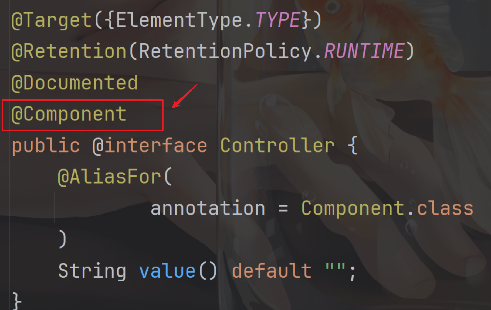
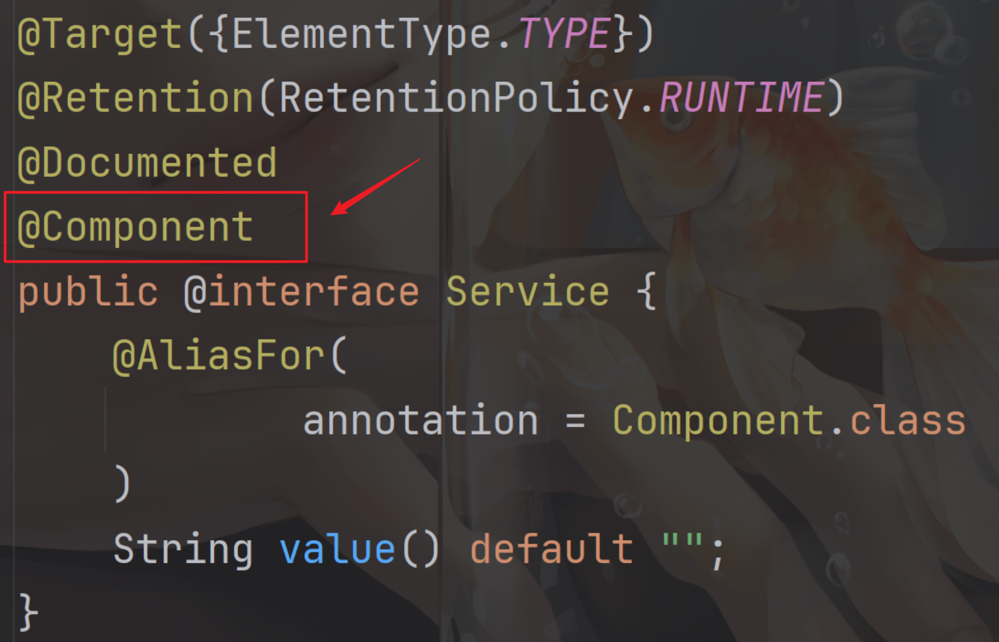
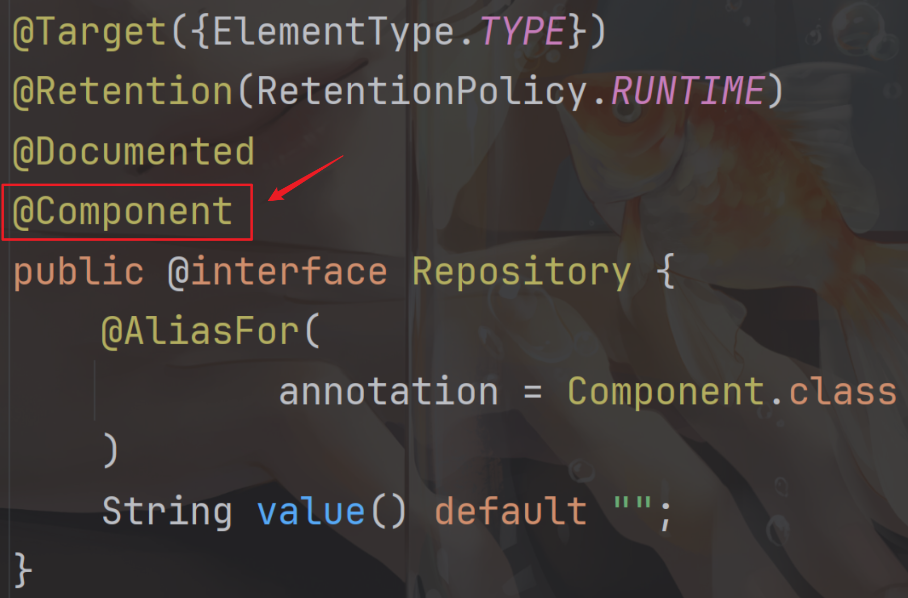
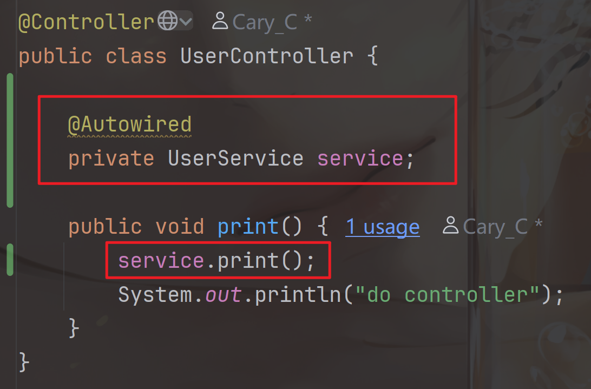
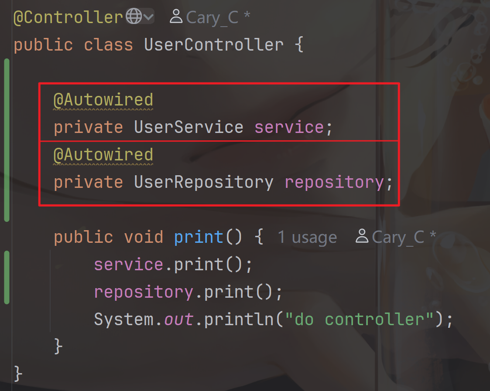
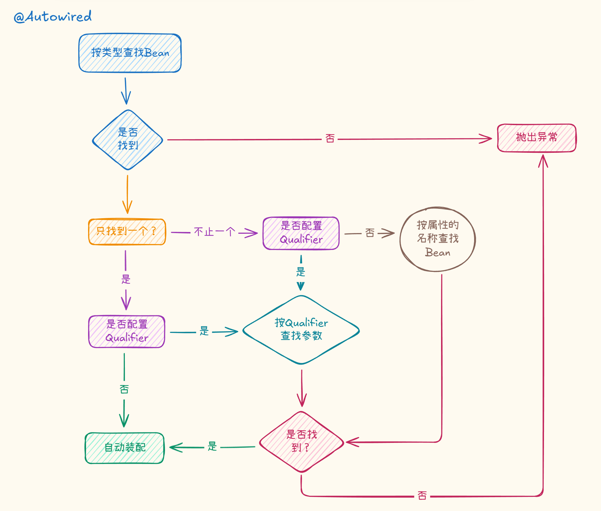

+++
date = '2025-12-08T17:12:08+08:00'
draft = true
title = 'SpringIoC & DI'
+++

# SpringIoC & DI

Spring两个核心思想：IoC和AOP

# IoC & DI

IoC全名为Inversion of Control，即“控制反转”，何为控制反转呢？

- 控制：指的是对象的创建、初始化、销毁和生命周期的管理权
- 反转：指这种管理权发生了反转：

  - 传统模式：一般是由程序员来手动new创建对象、并管理依赖，类似`UserController user = new UserController()`
  - IoC模式：对象的创建和依赖的注入权交给Spring来管理。程序不再由程序员主动来创建，而是被动等待Spring容器将所需的对象注入 / 提取出来

SpringIoC作为一个容器，它管理（装）的是对象（Bean），通过注解将对象交给Spring管理，有两类注解：

- 类注解：@Controller @Service @Repository @Configuration @Component
- 方法注解：@Bean

Q：为什么需要这种模式？

A：目的是为了解耦合，将对象的创建权交给Spring，各个组件之间不再强依赖，使得代码更加容易维护、管理与扩展

这里有简单的代码实力，对比传统模式与IoC模式的区别：假设我们有一个**用户服务 (**​**​`UserService`​**​ **)** ，它需要调用**数据访问层 (**​**​`UserDao`​**​ **)**  来把用户信息保存到数据库

1. 传统模式：在这种模式下，`UserService`​ **自己负责创建**它需要的依赖对象。

    ```java
    public class UserService {
        // ❌ 缺点：高度耦合
        // UserService 必须明确知道 UserDao 的具体实现类是哪个 (UserDaoImpl)
        // 如果将来想换成 UserDaoNewImpl，必须修改这里的代码
        private UserDao userDao = new UserDaoImpl();

        public void saveUser(String name) {
            userDao.add(name);
        }
    }
    ```

    - **控制权：**  在程序员手中。你必须手动写 `new UserDaoImpl()`。
    - **问题：**  代码“写死”了。如果你想做单元测试（Mock 一个假的 UserDao），非常困难。
2. Spring IoC模式（依赖注入）：在这种模式下，`UserService`​ **只定义它需要什么**，而不关心对象是怎么来的。Spring 容器负责把对象“递”进去。

    ```java
    import org.springframework.beans.factory.annotation.Autowired;
    import org.springframework.stereotype.Service;

    @Service // 1. 告诉 Spring：这个类交给你管理，它是一个 Bean（对象）
    public class UserService {

        // ✅ 优点：解耦
        // UserService 只知道它需要一个 UserDao 接口
        // 具体是哪个实现类，由 Spring 容器自动注入
        @Autowired 
        private UserDao userDao;

        public void saveUser(String name) {
            userDao.add(name);
        }
    }
    ```

    - **控制权：**  在 Spring 容器手中（反转了）。
    - **发生了什么：**

      1. Spring 扫描到 `@Service`​，创建并管理了 `UserService` 的实例。
      2. Spring 看到 `@Autowired`​，发现 `UserService`​ 需要一个 `UserDao`。
      3. Spring 在自己的容器里找到合适的 `UserDao`​ 实例，直接**注入**（赋值）给 `userDao` 变量。
    - 前提是`UserDao`​也需要被Spring管理，数据层一般添加`@Repository`注解管理

      ```java
      import org.springframework.stereotype.Repository;

      // 1. 定义接口
      public interface UserDao {
          void add(String name);
      }

      // 2. 实现接口，并加上 @Repository 注解
      @Repository 
      public class UserDaoImpl implements UserDao {
          
          @Override
          public void add(String name) {
              // 模拟数据库操作
              System.out.println("保存用户到数据库: " + name);
          }
      }
      ```

      - 看到这会疑惑为什么要专门写一个`UserDao`​接口，然后专门交给`UserDaoImpl`来实现？

      - **简短的回答是：**

        从技术上讲，完全**可以不写接口**，直接定义一个 `UserDao`​ 类并加上 `@Repository`，Spring 照样能工作

        但是使用**接口+实现类**的模式主要有以下优点：

        1. 这是面向对象设计（SOLID 原则）中的 D (Dependency Inversion Principle)思想——上层模块（Service）不应该依赖于下层模块（DAO）的具体实现，而应该依赖于**抽象**（接口）。

            ​`UserService`​只需要知道有`UserDao`​接口，只需要调用`UserDao`接口内的方法就好了，但具体怎么实现的则不需要知道（是用 MySQL 写的，还是用 Oracle 写的，或者是把数据写到了 Redis 里）

            **举例：**  如果有一天你需要把数据库从 MySQL 换成 MongoDB，你只需要新写一个 `UserDaoMongoImpl`​ 实现接口，而不需要修改 `UserService` 的任何一行代码。
        2. Spring AOP的原因

            AOP的底层原理是动态管理

            - JDK动态代理（标准）

              只能代理接口，如果Bean对象实现了接口，Spring会默认使用JDK动态代理，效率高，原生支持好
            - CGLIB代理（第三方）

              如果Bean对象没有实现接口，只是代理了一个普通的类，Spring就必须使用第三方CGLIB库，继承你的类并重写方法来生成代理

            虽然现在SpringBoot能很好的解决这一类问题，但使用接口配合JDK动态管理已经成为了一种惯例
        3. 💫ORM框架的特殊需求（如MyBatis、JPA）

            如果使用的是MyBatis或Spring Data JPA，那就只需要写接口，连实现类都不用写

            - MyBatis：你定义`UserMapper`接口，MyBatis会自动生成代理对象执行SQL
            - JPA：你定义`UserRepository`​接口，继承`JpaRepository`，Spring Data自动帮你生成增删改查的实现

            在这种情况下，实现接口是必须的，因为实现类是由框架在运行时动态生成的，你也无法去写一个具体的类

## 五大注解详解

- 类注解：@Controller @Service @Repository @Configuration @Component
- 方法注解：@Bean

着重讲一下类注解，能发现这有五种不同的类注解，但都能交给Spring管理，那他们的区别是什么呢？

不同的类注解从名字上就能看出主要应用在哪个层，最基本的项目开发都会有  **“控制层—>服务逻辑层—>数据层”**  的结构，如果更加复杂的项目开发分开的更加细致，所以不同的注解名字也能第一眼就能看出这个对象主要在哪个层在工作

**基本关系为：** 控制层调用服务层，服务层调用数据层，数据层返回结果给服务层，服务层再返回结果给控制层。

@Controller：控制层——接受参数，返回响应（前后端交互的入口）

@Service：业务逻辑层

@Repository：数据层

@Configuration：配置层

@Component：组件层——除此以外的所有需要交给Spring管理的对象都能用此注解

我们扒开源码查看，能看出他们之间的关系



其中@Controller @Service @Repository @Configuration 都实现了@Component，它们都是@Component的衍生注解

在实际应用中，这五个注解的边界并没有这么清晰，但控制层必须使用@Controller，不可以和其他注解替换

# BeanName

在Spring容器中取出对象时会使用对应的BeanName，类注解与方法注解都有不同的BeanName命名方法

1. 五大类注解

    BeanName默认为类名的小驼峰写法，如果类名前两位字母均为大写则BeanName为类名本身，举例：

    ```java
    @Controller
    public class UserController {
        public void print() {
            System.out.println("do controller");
        }
    }

    public static void main(String[] args) {
        /**
         * 获取 bean 的命名方式
         * 首字母需变小写
         * 如果连续两个大写字母开头则直接写
         */
        ApplicationContext run = SpringApplication.run(SpringIocApplication.class, args);
    	UserController bean = (UserController) run.getBean("userController");
    	bean.print();
    }
    ```

    1. 方法注解@Bean

        需要搭配五大注解使用，BeanName为默认方法名，举例：

        ```java
        @Component
        public class StudentComponent {
            @Bean
            public Student s1 () {
                return new Student("lili",9);
            }
            @Bean
            public Student s2 () {
                return new Student("Jack",25);
            }
        }

        public static void main(String[] args) {
        	/**
             * 同时在注解中也提供了对类 / 方法进行重命名
             * 包括 @Controller @Service @Configuration @Repository @Component @Bean
             * 注解后对应的类名 / 方法名则无效
             * 只能填重命名后的
             * @Bean("aaa")
             *     public Student s2 () {
             *         return new Student("Jack",25);
             *     }
             * 如果是run.getBean("s2") 报错：NoSuchBeanDefinitionException
             */
            Student s = (Student)run.getBean("s2");
            System.out.println(s);
        }
        ```

---

# DI详解

与之IoC匹配的就是DI，DI全名为Dependency Injection，即依赖注入，既然有IoC管理，那就会有DI从Spring容器中取出来，DI就是承担这样的角色——DI 是 IoC 的一种具体**实现方式**，也能理解为：**<u>容器通过注入依赖来实现控制反转，依赖注入是一个过程</u>**

## DI分三种方式注入

1. 属性注入
2. 构造方法注入
3. Setter注入

### 属性注入

属性注入是通过`@Autowired`​实现的。如果有多个属性需要逐行注入。`@Autowired`只对紧挨着那一行代码生效



### 构造方法注入

- 如果只有一种构造方法，则执行这一种构造方法，无论是有参构造还是无参构造

  ```java
  	private UserService service;

      public UserController(UserService userService) {
          System.out.println("执行有参构造方法");
          this.service = userService;
      }

      public void print() {
          service.print();
          System.out.println("do controller");
      }

  	// 启动项
  	UserController bean = text.getBean(UserController.class);
      bean.print();

  // 运行结果
  // 执行有参构造方法
  // do service
  // do controller
  ```

  执行成功，`print()`​拿到`service`对象

‍

- 如果有多种构造方法，则默认执行无参的构造方法

  1. 存在无参的构造方法

  ```java
  	private UserService service;
      private UserRepository repository;

      public UserController(UserService userService,UserRepository userRepository) {
          System.out.println("执行有参构造方法1");
          this.service = userService;
          this.repository = userRepository;
      }

      public UserController(UserService userService) {
          System.out.println("执行有参构造方法2");
          this.service = userService;
      }
      
      public UserController() {
          System.out.println("执行无参构造方法");
      }

      public void print() {
          service.print();
          repository.print();
          System.out.println("do controller");
      }

  	// 启动项
  	UserController bean = text.getBean(UserController.class);
      bean.print();
  ```

  

  由于执行的是无参的构造方法， `print()`​方法拿不到`service`​和`repository`对象，故报错

  ---

  2. 如果不存在无参构造方法，则直接报错。报错日志为：找不到默认的构造方法

  ```java
  	private UserService service;
      private UserRepository repository;

      public UserController(UserService userService,UserRepository userRepository) {
          System.out.println("执行有参构造方法1");
          this.service = userService;
          this.repository = userRepository;
      }

      public UserController(UserService userService) {
          System.out.println("执行有参构造方法2");
          this.service = userService;
      }
      
  //    public UserController() {
  //        System.out.println("执行无参构造方法");
  //    }

      public void print() {
          service.print();
          repository.print();
          System.out.println("do controller");
      }

  	// 启动项
  	UserController bean = text.getBean(UserController.class);
      bean.print();
  ```

  

  可以通过@Autowired 注解来指定构造方法，此时1. 和 2. 的情况都能解决，没有无参构造方法也不会报错，这两种情况都能运行

  ```java
  	private UserService service;
      private UserRepository repository;
      
      @Autowired
      public UserController(UserService userService,UserRepository userRepository) {
          System.out.println("执行有参构造方法1");
          this.service = userService;
          this.repository = userRepository;
      }


      public UserController(UserService userService) {
          System.out.println("执行有参构造方法2");
          this.service = userService;
      }

      public UserController() {
          System.out.println("执行无参构造方法");
      }

      public void print() {
          service.print();
          repository.print();
          System.out.println("do controller");
      }

  // 运行结果
  // 执行有参构造方法1
  // do service
  // do repository
  // do controller
  ```

​`@Autowired` 就是明确该使用哪个构造方法的

### Setter注入

​`Setter`​ 注入和属性的`Setter `​方法实现类似，只不过在设置 `set`​ 方法的时候加上`@Autowired` 注解，如下所示

```java
	// Setter 方法注入
    private UserService service;
    private UserRepository repository;

    @Autowired
    public void setUserService(UserService service) {
        this.service = service;
    }

    @Autowired
    public void setUserService(UserRepository repository) {
        this.repository = repository;
    }

    public void print() {
        service.print();
        repository.print();
        System.out.println("do controller");
    }
```

## <span id="20251202163358-mb6mufp" style="display: none;"></span>三种注入的优缺点

- 属性注入

  - 优点：**简洁，使用方便**
  - 缺点：

    **不能注入**​**​`final`​**​**修饰的属性**——<u>​`final`​</u>​<u>的属性有要求，一定需要初始化。要么在属性注入的时候进行初始化，要么在构造方法中进行初始化，但这都违背了注入的初衷：只想从Spring容器中取出来，不想手动初始化，否则我用</u>​<u>​`@Autowired`​</u>​<u>就没意义了</u>
- 构造方法注入

  Spring官方团队（以及Idea的提示）目前**最推荐使用的是“构造器注入”**

  - 优点：

    **可以注入**​**​`final`​**​**修饰的属性**——<u>可以在构造方法中进行初始化，也是解决</u>​<u>​`final`​</u>​<u>必须初始化的要求</u>

    **注入的对象不会被修改，除非有**​**​`set`​**​**方法再对对象修改，否则初始化后就定好了**

    **通用性好：构造方法是JDK支持的，所以更换任何框架都是使用的**

    **依赖对象在使用前一定被完全初始化，因为依赖是在类的构造方法中执行的，而构造方法是在类加载的阶段就会被执行——**​<u>从控制台也能简单看出来，先执行构造方法后再运行服务器</u>

    
  - 缺点：**注入多个对象时，代码比较繁琐**
- Setter注入

  - 优点：**方便在类实例后，重新对该对象进行配置或注入**
  - 缺点：

    **不能注入**​**​`final`​**​**修饰的属性**

    **注入对象可能会被修改，因为提供了setter方法，就有可能被多次调用修改的风险**——<u>==这也对应了构造方法的优点：注入的对象不会被修改==</u>

## @Autowired存在的问题

当同一个类型存在多个`Bean`​时，使用`@Autowired`会存在问题，示例代码如下：

```java
@Service
public class UserService {
    @Autowired
    private Student ss;

    public void print() {
        System.out.println(ss);
        System.out.println("do service");
    }
}

@Component
public class StudentComponent {
    @Bean("bbb")
    public Student s1 () {
        return new Student("lili",9);
    }

    @Bean("ccc")
    public Student s2 () {
        return new Student("Jack",25);
    }
}
```


能看到报错原因是，非唯一的`Bean`对象，Spring无法分辨该把哪个对象注入

如何在不删除`Bean`对象的前提下，解决上述问题呢？Spring给了三种注解

- ​`@Primary`
- ​`@Qualifier`
- ​`@Resource`

1. ​`@Primary`​：当存在多个相同类型的`Bean`​注入时，加上`@Primary`，确认默认的实现

    ```java
    @Service
    public class UserService {
        @Autowired
        private Student ss;

        public void print() {
            System.out.println(ss);
        }
    }

    @Component
    public class StudentComponent {
        @Bean
        @Primary // 指定该Bean为默认Bean的实现
        public Student s1 () {
            return new Student("lili",9);
        }

        @Bean
        public Student s2 () {
            return new Student("Jack",25);
        }
    }

    // 输出结果
    // Student(name=lili, age=9)
    ```

2. ​`@Qualifier`​：指定当前`Bean`​的对象，在`@Qualifier`​的`value`​属性注入`Bean`​的名字 **（默认也是value，内部只有一个String value）**

    

    **不能单独使用，需要配合**​ **​`@Autowired`​**

    ```java
    @Service
    public class UserService {
        @Autowired
        @Qualifier("s2")
        private Student ss;

        public void print() {
            System.out.println(ss);
        }
    }

    @Component
    public class StudentComponent {
        @Bean
        public Student s1 () {
            return new Student("lili",9);
        }

        @Bean
        public Student s2 () {
            return new Student("Jack",25);
        }
    }
    // 输出结果
    // Student(name=Jack, age=25)
    ```
3. ​`@Resource`​：按照`Bean`​的名称进行注入，通过`@Qualifier`​里的`name`​属性注入`Bean`的名字

    ```java
    @Service
    public class UserService {
    //    @Autowired
    //    @Qualifier("s2")
        @Resource(name = "bbb")
        private Student ss;

        public void print() {
            System.out.println(ss);
        }
    }

    @Component
    public class StudentComponent {
        // 作用是一样的
    //    @Bean({"bbb","ccc"})
    //    @Bean(value = {"bbb","ccc"})
        @Bean("bbb")
        public Student s1 () {
            return new Student("lili",9);
        }

        @Bean
        public Student s2 () {
            return new Student("Jack",25);
        }
    }

    // 输出结果
    // Student(name=lili, age=9)
    // 注意，使用重命名则原来方法命名就会失效，@Resource(name = "s1")会报错
    ```

## 常见面试题

1. @Autowired 与 @Resource 的区别

    - ​`@Autowired`​ 是Spring框架提供的注解，`@Resource` 是JDK提供的注解

      
    - ​`@Autowired`​默认是按照类型注入，`@Resource`​除了匹配类型，默认按照名称注入。相比于`@Autowired`​ ，`@Resource`​ 支持更多的参数设置，例如`name`​设置，根据名称来获取`Bean`
2. [三种注入的优缺点](#20251202163358-mb6mufp)
3. 常见注解有哪些？分别是什么作用？

    web URL 映射：@RequestMapping

    参数接收和接口响应：@RequestParam，@RequestBody，@ResponseBody

    Bean 的存储：@Controller，@Service，@Repository，@Configuration，@Component，@Bean

    Bean 的获取：@Autowired，@Qualifier，@Resource
4. [Spring、SpringMVC、SpringBoot之间的关系与区别](#20251202194306-k6nc3dz)

## @Autowired的装配顺序



## <span id="20251202194306-k6nc3dz" style="display: none;"></span>Spring、SpringMVC、SpringBoot之间的关系与区别

Spring在不同的角度回答也不同，分Spring和SpringFramework

- Spring：是Spring家族生态
- SpringFramework：是核心容器

‍

1. Spring (Spring Framework)

    它是整个家族的核心容器

    -  核心能力： IoC 和 AOP
    - 作用： 由Spring负责管理 Java 对象的生命周期，让对象之间解耦。如果没有 Spring，程序员需要手创建对象需要手动new Object()，极其难以维护

2. Spring MVC

    它是 Spring 框架中的一个Web 模块

    - 核心能力： 基于 Servlet 规范，实现了 MVC（Model-View-Controller）设计模式
    - 核心组件： DispatcherServlet（前端控制器）
    - 作用： 专门解决 WEB 开发的问题。它负责拦截用户发来的浏览器请求，分发给对应的 Java 方法处理，并返回数据或页面
    - 注意： 它是 Spring 的一部分，不是独立于 Spring 存在的。

3. Spring Boot

    对Spring的一种封装，是Spring的脚手架，它集成了Spring内的各种功能，并且是一套 **“约定大于配置”的工具集**。

    它没有创造新的技术（底层还是 Spring MVC, Spring Core），但它通过依赖管理和自动配置，把 Spring 家族原本零散的功能，打包成了一个可以直接运行的“脚手架”，让开发更专注于Spring应用的开发，无需过多关心XML的配置和底层的实现

    - 核心能力： 自动配置 + 起步依赖（Starter）+ 内嵌服务器（Tomcat/Jetty）

      快速搭建结构，保持稳定，SpringBoot强的地方在于版本管理，有一个父级配置文件，里面写死了几百种常用库的最佳兼容版本号，写代码时，引入依赖就不需要再写版本号，默认会使用SpringBoot规定的最佳版本号
    - 作用：

      - 简化配置： 以前用 Spring + SpringMVC，需要配置 web.xml, applicationContext.xml 等一堆文件。Spring Boot 通过扫描你的 jar 包，自动帮你把这些都配好了

      - 简化部署： 它把 Tomcat 这种 Web 服务器直接塞进了 jar 包里，你运行 java -jar 就能启动网站，不用再去独立安装 Tomcat

    🥱如何理解 **“约定大于配置”** ？

    不仅仅把核心的功能打包好，而且默认规定了一套规则，程序员开发过程中的约定，大部分都遵守这套规则，如果没有特殊的要求，那就按照默认的规则执行如：

    - web应用的端口号默认是8080

    - 代码写在哪里？只要你的代码放在主启动类（Main Application）所在的包或者子包下面，我就能扫描到

    - 静态资源（图片/JS/CSS）放哪里？Spring Boot 约定只要你把文件扔在 src/main/resources/static 文件夹里，我就直接对外开放访问

    总结：约定大于配置 = 系统自带一套“最佳实践”的默认值

    - 如果没特殊需求，就可以开箱即用
    - 有特殊需求：在application.properties里手动配置，灵活度高

**一句话总结：Spring MVC 和 Spring Boot 都属于Spring，Spring MVC 是 Spring的一个MVC 框架，Spring Boot 则是基于 Spring 的一套快速开发整合包（脚手架）**

‍
