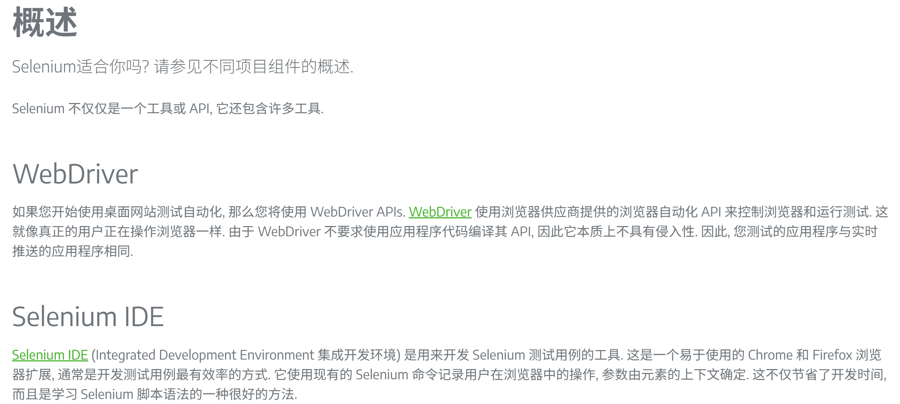
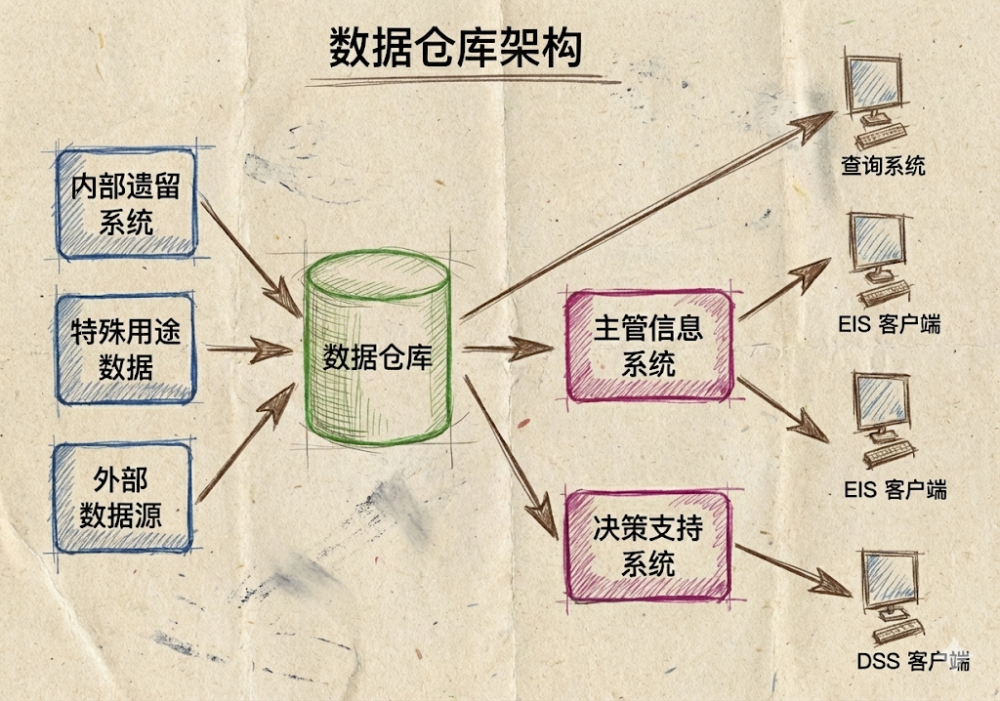
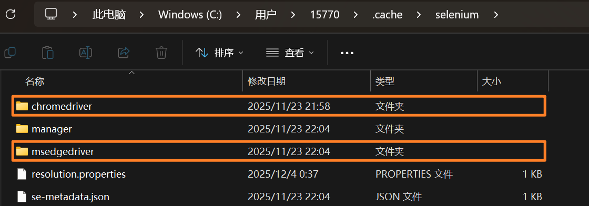
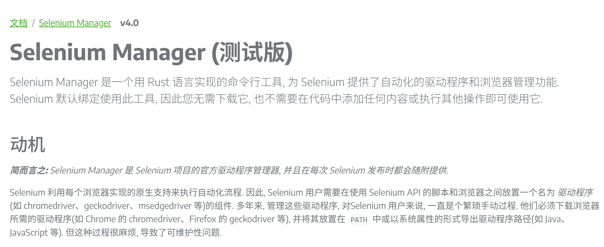
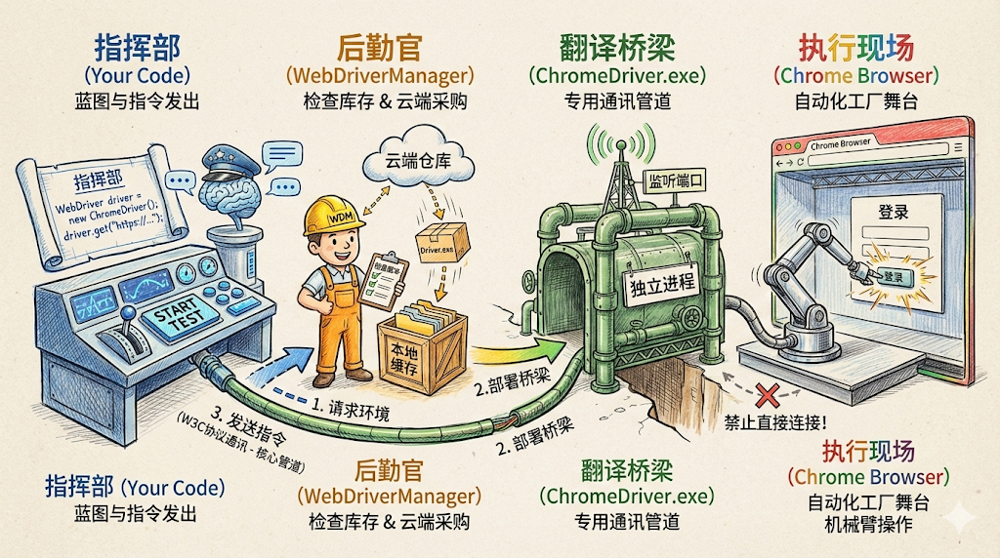
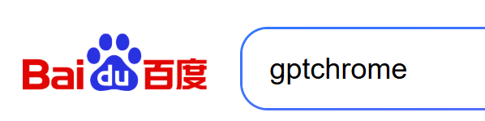
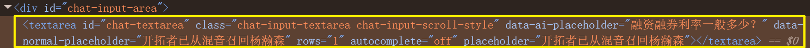

+++
date = '2025-12-12T17:16:00+08:00'
draft = true
title = '🎓 Web自动化测试'
categories = "测试"
+++
# 自动化测试

自动化测试包括

1. 接口自动化测试
2. UI自动化测试

    - Web自动化测试

    - 客户端界面自动化测试

**这次来讲讲Web 自动化测试。**

# 什么是 Web 自动化测试？

在大厂的研发流程中，自动化测试是\*\*CI/CD（持续集成/持续部署）\*\*不可或缺的一环。

简单来说，Web 自动化测试就是​**把原本需要人工在浏览器上点击、输入、验证的操作，通过代码指令让计算机自动执行**。

## Selenium 与 WebDriver

目前业界最主流的 Web 自动化工具就是 **Selenium**。虽然现在也有 Playwright 等新秀，但 Selenium 依然是很多大厂面试的基石。

### Selenium 是什么？

Selenium 不是一个单一的软件，它是一个工具套件。核心组件是 ​**Selenium WebDriver**。

- 它提供了一套跨语言的 API（Java, Python, C#, etc.）。
- 它通过“原生”方式与浏览器交互，就像真实用户在操作一样。

### WebDriver 的工作原理（面试）

这是Selenium官方文档对WebDriver的介绍



理解了这个图，你就懂了为什么需要下载“驱动”。



**它的运作流程是一个经典的“C/S 架构”（客户端/服务器）：**

1. **Client（你的代码）：**  你写的 Java 代码（发送命令，比如 `driver.get("www.baidu.com")`）。
2. **JSON Wire Protocol / W3C Protocol：**  代码将命令封装成 JSON 格式的 HTTP 请求，发送给驱动。
3. **Server（浏览器驱动）：**  比如 `chromedriver.exe`。它接收到 HTTP 请求后，解析命令，并调用浏览器的原生接口。
4. **Browser（浏览器）：**  执行操作（打开网页、点击按钮），并将结果返回给驱动，驱动再返回给你的代码。

‍

### Selenium与WebDriver的关系？（面试）

Selenium 是一个工具集，而 WebDriver 是其中用于通过原生协议驱动浏览器的核心 API。现在我们常说的 Selenium，通常默认指的就是 Selenium WebDriver。

### 安装Selenium库

安装Selenium在Java中只需引入Maven依赖即可

```java
<!-- https://mvnrepository.com/artifact/org.seleniumhq.selenium/selenium-java -->
    <dependency>
        <groupId>org.seleniumhq.selenium</groupId>
        <artifactId>selenium-java</artifactId>
        <version>4.37.0</version>
    </dependency>
// version 2025.12.6
```

Selenium内置了 WebDriver 的 API，但它**不包含浏览器驱动文件（exe），故需要手动下载 / 自动下载驱动**

程序想打开web浏览器就需要浏览器驱动，即（WebDriver），WebDriver以本地化的方式来驱动浏览器

## 关于“驱动” (Drivers)

浏览器驱动（BrowserDriver）是你的代码和浏览器之间的**桥梁**。

## 为什么需要驱动？

浏览器（Chrome, Firefox等）都是复杂的闭源或开源软件，出于安全考虑，不允许外部程序直接随意控制。浏览器厂商（Google, Mozilla）为了方便测试，自己开发了对外接口的“遥控器”，这个遥控器就是 Driver。

## 常见浏览器与驱动对应表

|**浏览器**|**驱动名称**|**下载关键词**|
| --| --------------| ------|
|**Google Chrome**|ChromeDriver|​`chromedriver`|
|**Firefox**|GeckoDriver|​`geckodriver`|
|**Microsoft Edge**|EdgeDriver|​`msedgedriver`|

## 驱动版本适配管理（重点）

> 版本匹配原则：这是新手最容易报错的地方。
>
> 你的 Chrome 浏览器版本 必须与 ChromeDriver 版本 严格对应。例如，浏览器是 v120，驱动也必须下载 v120 版本的。否则会报错 SessionNotCreatedException。
>
> 我们可以在浏览器内查看当前浏览器版本，安装的selenium 驱动版本，可以在本地c盘用户的`C:\Users\xxx.cache`文件下看到selenium文件夹，里面安装着不同的内核版本
>
> 

## 常见驱动下载方式

### 1. 手动下载（不建议）

 **（注：虽然可以有程序自动管理驱动，但了解手动匹配依然是基础)**

下载驱动的位置在Selenium官方文档中有提供，地址为

​`https://www.selenium.dev/documentation/webdriver/troubleshooting/errors/driver_location/#download-the-driver`

不建议手动下载，因为浏览器的更新功能是默认打开的，什么时候更新是不知道的。可能今天自动化正常执行，第二天就要重新下载最新版的驱动了，且不同的浏览器就要我们手动下载不同的驱动，非常麻烦。

这也不建议手动关闭浏览器的自动更新功能，不仅测试环境与生产环境有脱节，错过了新的自动化的功能或者改进的地方，而且可能导致Selenium库与旧的浏览器版本兼容，这种头疼砍头的操作不可取。

### 2. 由驱动程序自动下载

 **（注：Selenium 4.6.0 版本开始引入了 Selenium Manager，可以自动管理驱动，但了解WebDriverManager也是非常重要的基础）**

更好的做法不是禁用更新，而是采用更健壮的测试策略

需要引入WebDriverManager辅助工具库

- 用途：它可以让你不用手动去浏览器官网找对应版本的驱动下载，它会在代码运行时自动检测浏览器版本并下载对应的驱动。

引入WebDriverManager依赖

```java
<!-- https://mvnrepository.com/artifact/io.github.bonigarcia/webdrivermanager -->
    <dependency>
       <groupId>io.github.bonigarcia</groupId>
        <artifactId>webdrivermanager</artifactId>
        <version>6.1.0</version>
    </dependency>
// version 2025.12.6
```

### 3. 更新Selenium库至 4.6+ 版本

适用于更加新的项目，直接 new Driver()， Selenium就能给你匹配最新的驱动版本

Selenium文档中的描述



- **传统方案：**  使用 `webdrivermanager` 第三方库。适合维护旧项目（Selenium 3.x 或 4.x 早期版本）

  ```java
  // 传统方案
  WebDriverManager.chromedriver().setup(); // 手动呼叫后勤
  WebDriver driver = new ChromeDriver();
  ```
- **现代方案：**  直接使用 `selenium-java`​ (4.6+)，利用内置的 `Selenium Manager`，实现零辅助库配置启动

  ```java
  // 什么都不用配，直接 new
  // 底层会自动触发 Selenium Manager 去干活
  WebDriver driver = new ChromeDriver();
  ```

## 总结

我用Banana Pro生成了这一副插画，能更加形象的了解Web自动化测试执行的逻辑😽



## Web自动化常用函数

🙈与其像流水账一样罗列 API，不如**按照“业务场景”或者“对象层级”来分类**

### 浏览器级的操作（Driver）

这部分方法是直接作用于`WebDriver`​对象的，控制着浏览器的生命周期与状态，通常用于测试开始前的准备（Setup）或测试结束后的清理（Teardown），以及用于 “[断言](自动化测试/断言.md)” 的前置检查。

1. 获取页面信息 **（用于断言）**

    在自动化测试中，我们怎么知道脚本是不是跳转到了正确的页面？靠的就是这两个方法：

    - ​**​`driver.getTitle()`​** 

      - ​**介绍**：获取当前浏览器窗口标签页上的标题文本。
      - **用途**：这是最常用的断言点。比如登录成功后，验证标题是否包含“个人中心”或“首页”

      注意：如果新开窗口后没有切换driver，则driver依旧作用在旧窗口，识别不了另一个窗口的信息，如有需要用到切换窗口的方法，这就引出获取当前 / 所有句柄id
    - ​**​`driver.getCurrentUrl()`​** 

      - ​**介绍**：获取浏览器地址栏当前的 URL 字符串。
      - **用途**：验证重定向是否正确。比如支付完成后，URL 是否跳转到了 `/success` 页面。
    - ​**​`driver.getWindowHandle() / getWindowHandles()`​** 

      - 介绍：获取句柄（标签页）id
      - 用途：一般搭配切换句柄的操作

        ```java
        // getWindowHandle 获取driver当前标签页/句柄id
          String window = driver.getWindowHandle();
          System.out.println("window: " + window);

          // getWindowHandles 获取所有标签页/句柄id
          driver.findElement(By.xpath("//*[@id=\"s-top-left\"]/a[6]")).click();
          Set<String> handles = driver.getWindowHandles();    

        // 切换窗口操作
            for (String handle : handles) {
                if (!window.equals(handle)) {
                    driver.switchTo().window(handle);
                }
            }
            String jump_title = driver.getTitle();
            String jump_url = driver.getCurrentUrl();
            System.out.println("jump_title：" + jump_title);
            System.out.println("jump_url：" + jump_url);

        // 这样就能正确切换窗口且得到新窗口的title 和 url
        ```

2. 浏览器窗口调整

    ​**​`driver.manage().window().maximize()`​** ​  **/**   **​`.setSize(里面需传入Dimension对象，手动规定尺寸)`​** ：

    - **介绍**：自动化脚本启动时，默认通常是小窗口。
    - ​**用途**：

      - ​**全屏**​：通常建议在 `driver`​ 初始化后立即调用 `maximize()`，因为很多网页在小窗口下会折叠菜单（变成汉堡按钮），导致元素不可见或定位失败。
      - ​**指定尺寸**​：在测试“响应式布局”时，通过 `setSize()` 模拟手机或平板的分辨率。

3. 浏览器的关闭 **（面试）**

    - ​**​`driver.close()`​** ：

      - **介绍**：仅仅关闭**当前正在操作的那个标签页（Tab）或窗口**
      - **注意**：如果当前浏览器只有一个窗口，调用它也会导致浏览器退出，但它不会清除驱动进程。

    **避坑点：** 当调用 `driver.close()`​ 关闭当前标签页后，**WebDriver 并不会自动把焦点切换回剩下的那个标签页**

    **解决办法：**

    1. 在 close 前保存下当前句柄 id，然后删除后便于 driver 切换新的标签页（适用于随便去一个活着的窗口的情况）

        ```java
        		driver.get("https://www.baidu.com/");
                // 新开百度图片标签页
                driver.findElement(By.xpath("//*[@id=\"s-top-left\"]/a[6]")).click();
                // 删除当前标签页后 driver 指向空，无法对新开的百度图片标签页进行操作
                // 故需要在关闭标签页后切换句柄 使driver对象指向新的句柄
                String windowHandle = driver.getWindowHandle();
                Set<String> windowHandles = driver.getWindowHandles();

                driver.close();

                // 无法直接获得新的句柄的title 必须使driver切换句柄
        //        System.out.println(driver.getTitle()); // error~~

                // 需要切换句柄
                for (String handle : windowHandles) {
                    if (!handle.equals(windowHandle)) {
                        driver.switchTo().window(handle);
        				break；
                    }
                }
                System.out.println(driver.getTitle()); // success~~
        ```
    2. Parent-Child 模式（标准）

        在实际业务测试中（如：在列表页点击商品 -\> 弹出新标签页详情 -\> 验证完关闭详情 -\> 回到列表页继续点下一个）需要“从哪里来，回哪里去”的逻辑，**更有目的性地跳回**

        ```java
        // 场景：在 首页(A) 点击链接打开了 详情页(B)，处理完 B 后关闭并回到 A

        // 1. 【核心】在这一刻，Driver 还在 A 页面，先保存 A 的身份证
        String originalWindowHandle = driver.getWindowHandle();

        // 2. 执行打开新页面的操作
        driver.findElement(By.id("open-new-tab-link")).click();

        // 3. 切换到新窗口 (这里假设只要不是原窗口就是新窗口)
        for (String handle : driver.getWindowHandles()) {
            if (!handle.equals(originalWindowHandle)) {
                driver.switchTo().window(handle);
                break; // 切过去就不动了
            }
        }

        // --- 此时 Driver 已经在 B 页面了 ---
        System.out.println("在新页面操作: " + driver.getTitle());

        // 4. 业务结束，关闭当前的新页面 B
        driver.close(); 
        // ⚠️ 此时 Driver 是悬空的，指向一个不存在的 B

        // 5. 【核心】显式切换回原窗口 A
        driver.switchTo().window(originalWindowHandle);

        // --- 此时 Driver 又回到了 A 页面，复活了 ---
        System.out.println("回到原页面: " + driver.getTitle());
        ```

    - ​**​`driver.quit()`​** ：

      - **介绍**：**彻底关闭整个浏览器，关闭所有打开的标签页，并销毁 ChromeDriver 进程**。
      - **注意**：**在自动化测试框架的** **​`finally`​**​ **块或**  **​`@After`​**​ **钩子中，必须使用** **​`quit()`​** ​ **，否则你的服务器内存会被浏览器进程吃光。强调资源释放的重要性！**

### 对元素级操作（Element）

需要先通过 `driver.findElement()`​ 找到元素`WebElement`后才能调用后续的方法。这是自动化测试中最繁忙的部分，简单来讲就是模拟人类的手指的各种操作

1. 输入与交互

    - ​**​`element.sendKeys("text")`​** ：

      - ​**介绍**：模拟键盘向输入框输入指定内容。
      - ​**高阶用法**​：它不仅能输入文字，还能用于​**文件上传**​（如果 input 类型是 file，直接 sendKeys 文件路径即可），或者模拟按键（如 `Keys.ENTER`）。
    - ​**​`element.clear()`​** ：

      - **介绍**：清空输入框中的已有文本。

      **避坑**：在调用 `sendKeys`​ 之前，建议先调用 `clear()`​。因为如果输入框有默认值，`sendKeys` 会直接追加在后面，导致数据错误。如：

      ```java
      // 如果不进行clear操作，则会在“gpt”文本后追加“chrome”文本
      driver.get("https://www.baidu.com/");
      driver.findElement(By.xpath("//*[@id=\"chat-textarea\"]")).sendKeys("gpt");
      // 应该clear上一次的文本
      // driver.findElement(By.xpath("//*[@id=\"chat-textarea\"]")).clear();
      driver.findElement(By.xpath("//*[@id=\"chat-textarea\"]")).sendKeys("chrome");
      driver.findElement(By.xpath("//*[@id=\"chat-submit-button\"]")).click();
      ```

      
    - ​**​`element.click()`​** ：

      - ​**介绍**：模拟鼠标左键点击。
      - ​**适用**：不仅是按钮，超链接、复选框、单选按钮，甚至普通的文本（如果有点击事件）都可以点。

2. 获取元素信息

    - ​**​`element.getText() / .getAttribute("value")`​** ：

      - ​**介绍**​：获取元素标签对之间的​**可见文本**。
      - ​**用途**：这是验证测试结果的核心。比如下单成功后，获取页面上的提示语“支付成功”，与预期结果进行比对。
      - **注意**：如果元素在页面上被隐藏（Hidden），这个方法通常会返回空字符串。

      **避坑点：** 如果为了获取输入框里用户输入的值，用 `getText()`​ 是拿不到的，必须用 `getAttribute("value")`

      比如想获取红色框的文字，定位这元素所在的位置

      

      发现文字是在`placeholder`​属性内的，必须要用`getAttribute("placeholder")`才能拿到！

      ​`getText()`​适合用在<标签> <u>**"xxxx"**</u> <标签>被标签内包裹的文本信息，如

      

### 窗口与句柄切换

1. ​**​`driver.switchTo().window(handle)`​** ：

    - ​**核心概念——句柄 (Handle)** ：每个标签页都有一个唯一的身份证号，叫句柄。
    - **场景**：当点击了一个链接，浏览器打开了一个**新的标签页**。此时虽然人眼看到了新页面，但 `driver`​ 的焦点还停留在**旧页面**上。如果直接操作新页面的元素，会报错：`NoSuchElementException`
    - ​**操作逻辑**：

      1. 获取所有窗口的句柄：`driver.getWindowHandles()`。
      2. 遍历这些句柄，排除掉当前句柄。
      3. 使用 `switchTo().window(新句柄)` 将控制权移交到新页面。

    ```java
    // getWindowHandle 获取driver当前标签页/句柄id
      String window = driver.getWindowHandle();
      System.out.println("window: " + window);

      // getWindowHandles 获取所有标签页/句柄id
      driver.findElement(By.xpath("//*[@id=\"s-top-left\"]/a[6]")).click();
      Set<String> handles = driver.getWindowHandles(); 

    // 切换窗口操作 （随机切换式）
        for (String handle : handles) {
            if (!window.equals(handle)) {
                driver.switchTo().window(handle);
    			break;
            }
        }
    // 这样就能正确切换窗口
    ```

‍
