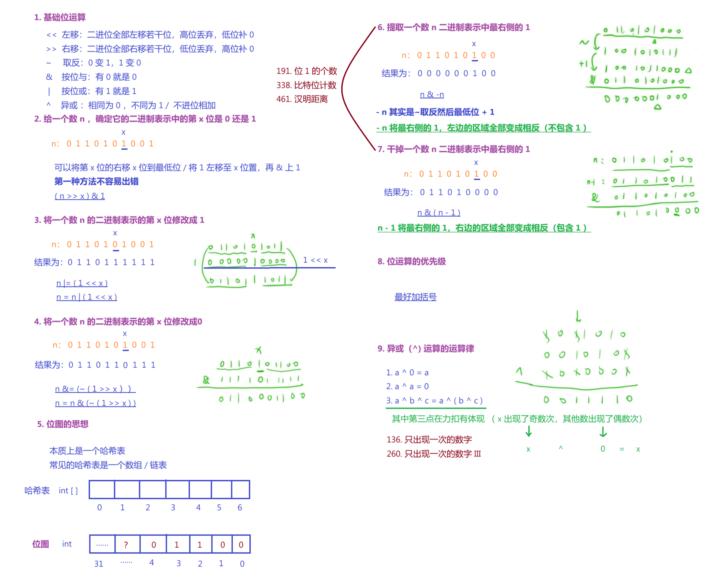
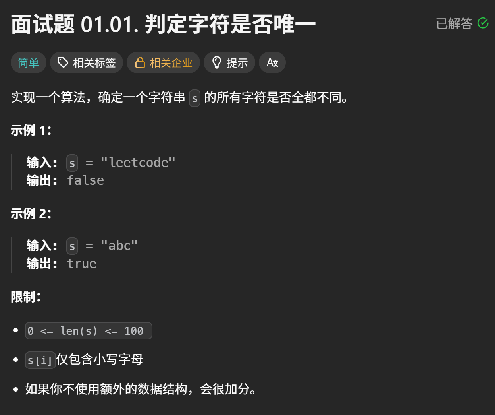
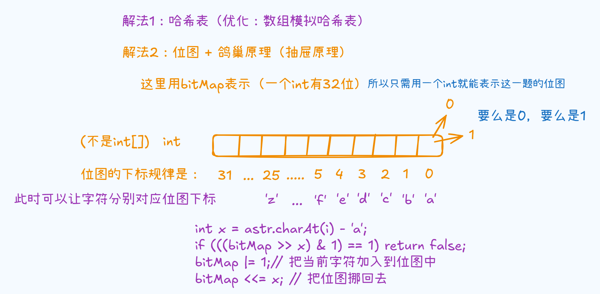

+++
date = '2025-12-24T23:35:35+08:00'
draft = true
title = '🛹 位运算类题目'
categories = "算法"
+++


位运算总结图



---

# [判定字符是否唯一](https://leetcode.cn/problems/is-unique-lcci/)



如何从浅到深的挖入这道题？从常见的哈希表到数组模拟哈希表到用到位图思想，想到了用位图

**鸽巢原理**对位图进行优化：如果字符串的长度大于26，则一定是有重复的（一共且只有26个英文字母，顶多刚好从a ~ z 全部都过一遍）



代码实现

```java
	public boolean isUnique(String astr) {
        // 位图 + 鸽巢 / 抽屉原理 (优化)
        int bitMap = 0;
        // 鸽巢 / 抽屉原理(优化)
        // 如果字符串的长度大于26，则一定是有重复的（一共且只有26个英文字母，顶多刚好从a ~ z 全部都过一遍）
        if (astr.length() > 26) return false;

        for (int i = 0; i < astr.length(); i++) {
            int x = astr.charAt(i) - 'a';
            // 先判断字符是否在位图中
            if (((bitMap >> x) & 1) == 1) return false;
            bitMap |= 1;// 把当前字符加入到位图中
            bitMap <<= x;
        }
        return true;
    }

```
保持更新中...