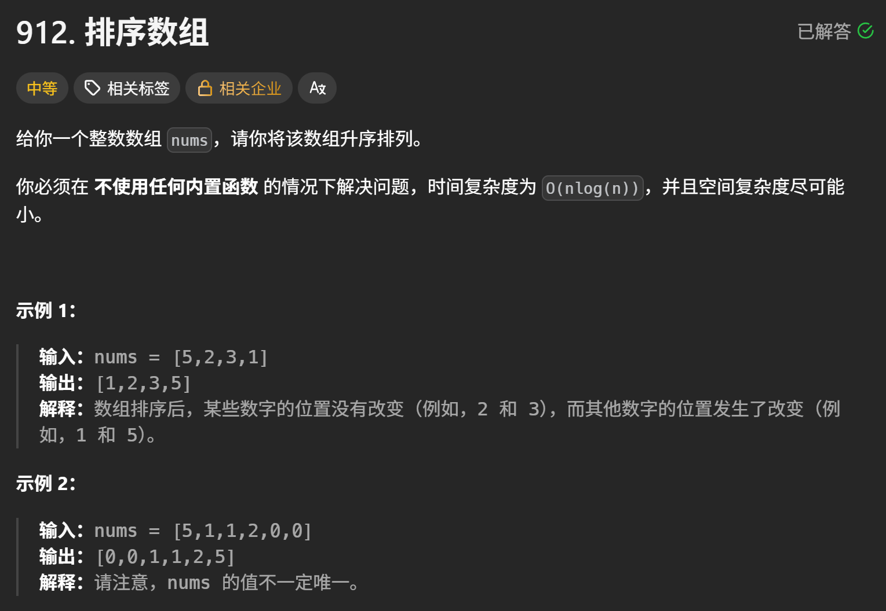

+++
date = '2025-12-20T01:12:18+08:00'
draft = true
title = '🪭 分治-归并类题目'
categories = "算法"
+++

# [归并数组](https://leetcode.cn/problems/sort-an-array/)



类似于分治快排，归并是从底下往上递归排序，快排是先解决当前部分再往下排，两个的顺序是反的~

```java
class Solution {
    int[] tmp; // 辅助数组
    public int[] sortArray(int[] nums) {
        // 分治归并
        if (nums == null || nums.length == 0) return null;
        tmp = new int[nums.length];
        mergeSort(nums, 0, nums.length - 1);
        return nums;
    }

    public void mergeSort(int[] nums, int left, int right) {
        // 中止条件
        if (left >= right) return;

        // 1. 选取中间点
        int mid = (right + left) / 2;

        // 2. 递归左右区间排序
        mergeSort(nums, left, mid);
        mergeSort(nums, mid + 1, right);

        // 3. 排序(双指针)
        // int[] tmp = new int[right - left + 1];// tmp每次都要new 消耗资源 故放到全局变量中
        int cur1 = left, cur2 = mid + 1, i = 0;
        while (cur1 <= mid && cur2 <= right)
            tmp[i++] = nums[cur1] <= nums[cur2] ? nums[cur1++] : nums[cur2++];
            
        // 细节问题：cur1 或者 cur2 可能没有走到最后
        // 虽然是两个while 但也只会执行其中一个
        while (cur1 <= mid) tmp[i++] = nums[cur1++];
        while (cur2 <= right) tmp[i++] = nums[cur2++];

        // 4. 归并合到一起
        for (int j = left; j <= right; j++) 
            nums[j] = tmp[j - left]; // tmp 要从0开始取
    }
}
```

---

# [数组中的逆序对](https://leetcode.cn/problems/shu-zu-zhong-de-ni-xu-dui-lcof/)


本质上就是依靠“排序数组 + 元素的相对位置不变”的逻辑，从而优化计算逆序对的策略，使其时间复杂度由单个遍历元素的 <u>$o(N²)$</u>​<u> -> </u>​<u>$o(1)$</u>  

## 思路总结

1. 最初以暴力枚举开始，必然会超时$o(N$​<sup>$2$</sup>​$)$，思考如何优化统计逆序对的逻辑并非单一的枚举每一个元素

第一版

```java
// 这里的嵌套循环和重置 cur2，本质上还是 O(N^2)
while (cur1 <= mid) {
    while (cur1 <= mid && cur2 <= right) {
        if (nums[cur1] > nums[cur2]) count++; // 还是在暴力找
        cur2++;
    }
    cur2 = mid + 1; // 回退指针，复杂度爆炸
    cur1++;
}
```

2. 能**利用数组的单调性**​ **，** 批量处理元素之间的大小关系（比如 A \> B，那 A 后面比 A 大的肯定也 \> B），**<u>此时逆序对的数量就能以</u>**​**<u>$o(1)$**</u>​**<u>的时间复杂度计算</u>**

3. [归并排序](https://leetcode.cn/problems/sort-an-array/description/)（分治）的思想能解决这种问题，不会打乱各自的相对位置，**递归**会让各自左区间与右区间都是有序的
4. 优化左右两边`[left, mid] [mid + 1, right]`​都为有序数组，维护一个辅助数组`int[] tmp`​ + 双指针`int cur1, cur2`。这里以递增数组为例，遇到小的元素就往辅助数组上放
5. 在排序中统计逆序对有两种方式：

- 单调递增数组中找逆序对——**<u>如果有序递增的左侧数字都比右侧的某一数字都大，那么左边剩下的肯定也比它大</u>**

```java
// 最终核心 Merge 逻辑
while (cur1 <= mid && cur2 <= right) {
    if (nums[cur1] <= nums[cur2]) {
		// 没有逆序对的情况
        // 将小的放进tmp数组中，并移动cur1指针
        tmp[i++] = nums[cur1++];
    } else {
        // 左边大于右边，则左边 cur1 之后的所有数都能和 cur2 构成逆序对
        count += (mid - cur1 + 1); // 👈为了优化这里
        tmp[i++] = nums[cur2++]; // 将小的放进tmp中，移动cur2指针，找下一组逆序对
    }
}
```

- 单调递减数组中找逆序对——<u>**如果递减的右侧数字比左侧区域的某一数字都要小，那么右边剩下的肯定也比它小**</u>

```java
// ⭐从小到大的递减数组版本(只需要更改这里的逻辑，其他代码不变)
// [left, mid] [mid + 1, right]
// 如果递减的右侧数字比左侧区域的某一数字都要小,那么右边剩下的肯定也比它小
while (cur1 <= mid && cur2 <= right) {
	if (nums[cur1] <= nums[cur2]) {
		// 没有逆序对的情况
		// 将大的放进tmp数组中，并移动cur2指针
		tmp[i++] = nums[cur2++];
	} else {
		count += right - cur2 + 1; // 递减后的逻辑区域取的是右边的数组区域
		tmp[i++] = nums[cur1++]; // 移动cur1指针，找下一组逆序对
	}
}
```

6. 分类讨论：以递增数组为例，每遇到小的元素就将它放到数组`tmp`上，然后移动对应指针
7. 剩余元素的处理 **（边界问题）** ：主循环结束后，通常会有一边还剩下一部分元素，`cur1`​ 或 `cur2`​ 没走完的情况，需要将剩下的**<u>有序数组**</u>都放到`tmp`上

```java
// 收尾阶段：直接搬运，无需比较，因为子数组已保证有序
while (cur1 <= mid) 
    tmp[i++] = nums[cur1++];
while (cur2 <= right) 
    tmp[i++] = nums[cur2++];
```

## 细节问题

### **排序是否破坏相对位置**

- ​**疑问**：在递归过程中对子数组进行排序，是否会破坏元素原始的前后位置，导致逆序对统计错误？
- **结论**：不会——明白了两边的相对位置，只对当前分区的元素位置优化，对结果并没有影响，而且逆序对是肯定存在的

### **剩余元素的处理（边界问题）**

- 问题：主循环结束后，通常会有一个数组还剩下一部分元素。我初次尝试时，试图在处理剩余元素的 while 循环中继续进行大小比较 (nums[cur] \> nums[cur+1])，导致数组越界
- 数组必然是有序的 -\> 根据递归，假设一路递归到只剩一个元素，那它肯定就是有序的，然后一级一级往上返回 -\> 那么剩下的数字其实也是底下一层返回来的部分有序的数组，剩下的那部分元素必然有序
- 解决方案：不需要做任何比较或交换，直接将剩余元素按顺序填入临时数组即可

代码实现

```java
class Solution {
    int count = 0;
    int[] tmp; // 辅助数组
    public int reversePairs(int[] nums) {
        int n = nums.length;
        if (n <= 1) return 0;
        tmp = new int[n];
        mergeSort(nums, 0, n - 1);
        return count;
    }

    public void mergeSort(int[] nums, int left, int right) {
        // 中止条件
        if (left >= right) return;
        // 取中间
        int mid = (right + left) / 2;

        // 继续往下递归
        mergeSort(nums, left, mid);
        mergeSort(nums, mid + 1, right);

        // 分类讨论
        // 优化左右两边都为有序数组(利用暂存数组与双指针来排序)————为了优化查找逆序对的逻辑
        // 如果有序递增的左侧数字都比右侧的某一数字都大，那么左边剩下的肯定也比它大
        // 此时逆序对的数量就能以o(1)的时间复杂度计算
        int cur1 = left, cur2 = mid + 1,i = 0;
        while (cur1 <= mid && cur2 <= right) {
            if (nums[cur1] <= nums[cur2]) {
                // 没有逆序对的情况
                // 将小的放进tmp数组中，并移动cur1指针
                tmp[i++] = nums[cur1++];
            }
            else {
                // nums[cur1] > nums[cur2]的情况
                count += mid - cur1 + 1; // 👈为了优化这里
                tmp[i++] = nums[cur2++]; // 将小的放进tmp中，移动cur2指针
            }
        }

		// ⭐从小到大的递减数组版本(只需要更改这里的逻辑，其他代码不变)
        // [left, mid] [mid + 1, right]
        // 如果递减的右侧数字比左侧区域的某一数字都要小,那么右边剩下的肯定也比它小
        // while (cur1 <= mid && cur2 <= right) {
        //     if (nums[cur1] <= nums[cur2]) {
        //         // 没有逆序对的情况
        //         // 将大的放进tmp数组中，并移动cur2指针
        //         tmp[i++] = nums[cur2++];
        //     } else {
        //         count += right - cur2 + 1; // 递减后的逻辑区域取的是右边的数组区域
        //         tmp[i++] = nums[cur1++]; 
        //     }
        // }

        // 处理部分未放到tmp的有序数组
        // 为什么是剩下的数组都是有序的？————从最底层返回的单个数字就是有序的数组 
        // 原本剩下的数字其实也是底下一层返回来的部分有序的数组
        while (cur1 <= mid) 
            tmp[i++] = nums[cur1++];
        while (cur2 <= right) 
            tmp[i++] = nums[cur2++];

        // 为上一层返回有序数组，注入到nums中
        for (int j = left; j <= right; j++) // 注意j <= right 
            nums[j] = tmp[j - left];
    }
}
```

---

‍
