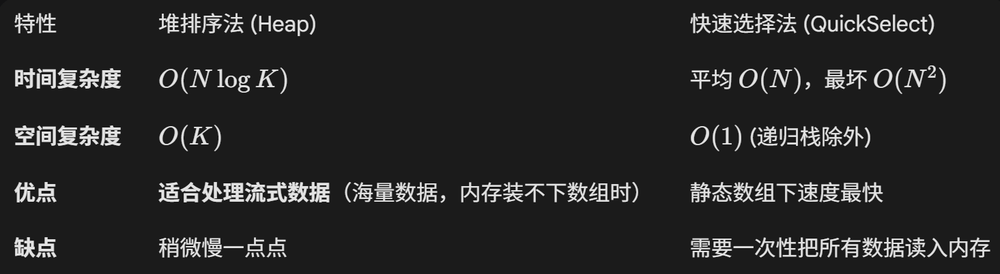
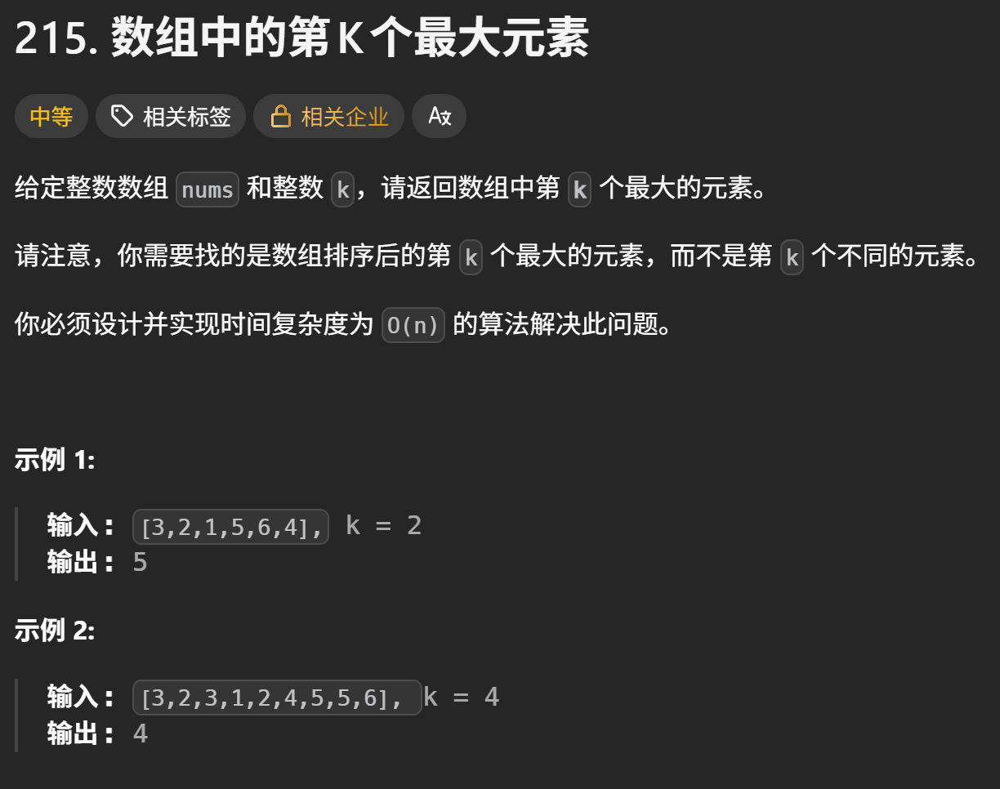
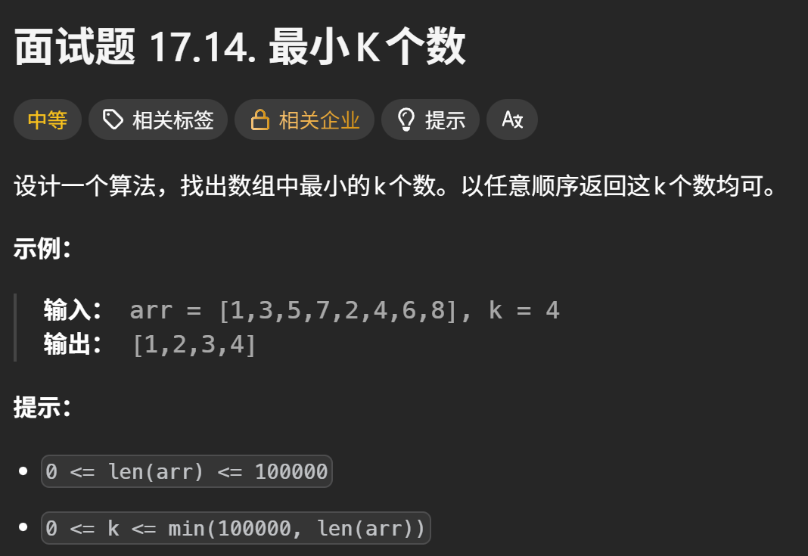

# topK问题

topK问题是经典的算法题，包括有（第k大、第k小、前k大、前k小），这类题的解决方法也比较固定

1. 堆排序

**一句话总结：找前 K 大，用 Size 为 K 的小顶堆；找前 K 小，用 Size 为 K 的大顶堆。**

|**题目需求**|**使用的堆**|**核心逻辑**|
| --| --| ---------------------------------------------------------------------------------------------------------------------------------|
|**求前 K 个最大的数**|**小根堆**|我们需要**淘汰**掉比较小的元素。小根堆的堆顶是堆中最小的，只要新来的元素比堆顶大，就把堆顶踢走，新元素进堆。最后剩下的 K 个就是最大的。|
|**求前 K 个最小的数**|**大根堆**|我们需要**淘汰**掉比较大的元素。大根堆的堆顶是堆中最大的，只要新来的元素比堆顶小，就把堆顶踢走，新元素进堆。|

2. 快速排序

# 堆排序 vs 快速排序



# 面试

如果在面试中遇到这种场景，**立刻切换到堆排序思路**：

> “给你 10 亿个数字，内存只有 1GB，请找出最大的 100 个数。”

这时候你不能用 QuickSelect，因为你没办法把 10 亿个数字一次性加载到数组里进行 Partition。但你可以建一个只有 100 个格子的**小顶堆**，让这 10 亿个数字一个个流过去进行“守门员PK”，内存占用极小

# 第K个最大



## 堆排序

**这是最反直觉的地方**： 题目要找  **“第 K 个最大的元素”** （或者前 K 大），我们通常使用 **小顶堆**，且这个堆的大小固定为 **K**

用Gemini举例的“守门员”机制就能理解**<u>排升序建大堆，排降序建小堆</u>**了，找K大实际上就是排降序，取第K个大的元素

**<u>==形象的比喻：“精英俱乐部”的守门员==</u>**

想象你要选拔全校“最富有的 10 个人”（Top 10）。你建了一个只有 10 个座位的“富豪俱乐部”。

1. ​**初始阶段**：前 10 个人直接进屋坐下。
2. ​**竞争阶段**：第 11 个人来了。他想进屋，该跟谁比？

    - 肯定不能跟屋里最有钱的人比（那是老大，不用动）。
    - 他应该跟屋里  **“最穷”**  的那个人（第 10 名）比。
3. ​**淘汰机制**：

    - 如果第 11 个人 ​**比屋里最穷的人还有钱**，那把“最穷”的那个踢出去，第 11 个人坐下。
    - 如果第 11 个人 ​**连屋里最穷的都比不过**，那直接走人，别想进屋。

在这个比喻里：

- **俱乐部** \= 堆（Heap）
- **屋里最穷的人** \= **堆顶（Root）**
- 因为我们要随时能找到“最穷”的那个人来做比较标准，所以我们需要 **小顶堆**（堆顶最小）。

假设我们要从数组 `[3, 2, 1, 5, 6, 4]`​ 中找 **第 2 大** 的元素 (`k=2`​)。 我们需要维护一个 **Size**  **=**  **2** 的小顶堆。

1. **填满堆（前 k 个）：**  先把 `3, 2` 放进去。

    - 堆状态（小顶）：`[2, 3]` （堆顶是 2）
2. **遍历剩下的元素：**

    - **遇到 1：**  1 \< 2 (堆顶)。连门槛都够不着，​**丢弃**。
    - **遇到 5：**  5 \> 2 (堆顶)。挑战成功！

      - 弹出 2，放入 5。
      - 堆调整后状态：`[3, 5]` （堆顶变成了 3）。
    - **遇到 6：**  6 \> 3 (堆顶)。挑战成功！

      - 弹出 3，放入 6。
      - 堆调整后状态：`[5, 6]` （堆顶变成了 5）。
    - **遇到 4：**  4 \< 5 (堆顶)。挑战失败，​**丢弃**。

**最终结果：**  堆里剩下 `[5, 6]`​。这是全数组最大的两个数。**答案：**  堆顶 `5`，就是第 2 大的数。

```java
public int findKthLargest(int[] nums, int k) {
        // 使用堆排序（NlogN）
        // 找第K大的，实际是使用降序，降序用小顶堆
        // PriorityQueue 默认是小顶堆，无需传入Comparator
        // 创造大小为k的
        PriorityQueue<Integer> queue = new PriorityQueue<>(k);
        // 遍历每个元素
        for (int x : nums) {
            // 如果堆没满，直接加进去
            if (queue.size() != k) 
                queue.offer(x);
            else {
                // 开始对比
                if (x > queue.peek()) {
                    queue.poll();
                    queue.offer(x);// offer时PriorityQueue会自动排序，最小的排到堆顶
                } else {
                    // 忽略，下一个
                }
            }
        }
        // 由于queue容量是k，且是小顶堆，所以最顶上那个元素一定是第K大的元素
        return queue.peek();
    }
```

## 快排

本质上是采用了 “分治” 的思想

**核心逻辑：** 快排的核心是 `partition`​（分区），每次操作后，基准元素（pivot）都会回到它在有序数组中**最终应该在的位置**。

可以把它想象成整理为有序数组的过程（从小到大）：

1. **选基准**：你从数组里随便拿出有一个元素作为**基准（Pivot）** 。

选基准元素也很有讲究，一般是使用Random类

```java
int randomIndex = l + new Random().nextInt(r - l + 1);
int randomKey = nums[randomIndex];
```

2. **分区（Partition）** ：假如把它分为三部分，分别是 <Pivort、=Pivort、>Pivort、把所有**比它大**的书都扔到它右边，**比它小**的书都扔到它左边，**跟它相等**的就落到中间的分区

3. **归位**：做完这一步，两边的元素可能还是乱的（虽然每个区之间还没有排好序，但是已经限制了分区，再怎么排都是在那个区间内动——<Pivort、=Pivort、>Pivort），这个元素的位置就**固定**了。接下来就是它左右分区的继续再执行 <u>**选基准 —> 分区**</u> 的递归操作，直到整个数组都排好~


```java
public int findKthLargest(int[] nums, int k) {
        return qsort(nums, 0, nums.length - 1, k);
    }

    public int qsort(int[] nums, int l, int r, int k) {
        // 判断边界条件，且这里不存在 l > r 的情况
        if (l == r) return nums[l];
        // 随机选择基准元素randomKey
        int randomIndex = l + new Random().nextInt(r - l + 1);
        int randomKey = nums[randomIndex];
        // 根据基准元素，使数组分三区
		// 这里使用三指针
        int left = l - 1,right = r + 1; 
        for (int i = l; i < right; ) {
            if (nums[i] > randomKey) {
                // 放右边，由于交换出的元素是未知的，未扫描，故不能i++
                swap(nums, --right, i);
            }
            else if (nums[i] < randomKey) {
                // 放左边，且交换出的元素已经上一轮扫描过，故i++
                swap(nums, ++left, i);
                i++;
            } else i++; // 重复元素直接跳过
        }

        // 分类讨论：判断第k大落在的区间
        // [l, left] [left + 1, right - 1] [right, r]
        int a = (left - l) + 1, b = (right - 1) - (left + 1) + 1, c = (r - right) + 1; // abc 分别代表不同分区的元素个数
        if (c >= k) {
            // 在 >randomKey 区间，继续寻找
            return qsort(nums, right, r, k);
        } else if (b + c >= k) {
            // 上述 c >= k 不成立 则一定落在 ==randomKey 区间 直接返回
            return randomKey;
        }else {
            // 落在 < key 分区，则找的是 k - b - c的位置，因为 >=key 的都抛弃了，第k 大元素肯定不落在范围内
            return qsort(nums, l, left, k - b - c);
        }
    }

    public void swap(int[] nums,int x ,int y) {
        int tmp = nums[x];
        nums[x] = nums[y];
        nums[y] = tmp;
    }
```

### 细节问题

为什么分类讨论的时候 k 要与 abc 代表不同分区的元素个数进行比较？

举个栗子就懂了~

假设我们要找全班**第** **​`k`​**​ **名**（第 k 大）

**C 区（>key）：特等生区**这里有 `c` 个人，他们是全班分数最高的。

- **判断：**  如果 `c >= k`（比如特等生有 10 人，你要找第 5 名）。
- **结论：**  那第 k 名肯定在这个人堆里。
- **动作：**  `return qsort(nums, right, r, k);` （去特等生区里继续找第 k 名）。

**B 区（=key）：** 有 `b` 个人，分数与key一致

- **判断：**  上面的 `c >= k`​ 不成立，说明特等生人数不够 `k`​ 个。这时候看 `b + c >= k`
- **结论：**  既然 B 区的人分数都一样，随便抓一个就是答案
- **动作：**  `return randomKey;`

**A区（<key）：** 有 `a` 个人，分数比较低

- **判断：**  前面的都不成立。说明 C 区（特等生）和 B 区（优等生）加起来的人数都不够 `k` 个

  - 这时候我们把前 8 名都排除了，我们要去 A 区找
- **为什么要减：**

  - 在 A 区里，这些人不知道前面还有 8 个人比他们强。
  - 对于 A 区内部来说，我们要找的那个目标，是 A 区里的第 `10 - 3 - 5 = 2`​ 名（第 `10 - c - b` 名）
- **动作：**  `return qsort(nums, l, left, k - b - c);`

---

此qsort方法将`partition`​ 和 `quickSelect`结合起来了，其实思想都是一样的，只是写法不一样，qsort一次性写完了

其中上述代码中的分类讨论部分的就是`quickSelect`，像是是指挥官，故判断是否符合条件也是在这里判断

​`partition`则是干累活的，负责根据基准元素，使数组分三区的

# 最小K个数



**这题有三种解法**

## 排序 

时间复杂度：o(N*logN)

实现代码

```java
	public int[] smallestK(int[] arr, int k) {
        // 1. 边界处理
        if (k == 0 || arr == null || arr.length == 0) {
            return new int[0];
        }
        // 2. 排序
        Arrays.sort(arr);
        // 3. 取前 K 个
        return Arrays.copyOf(arr, k);
    }
```

## 堆（大根堆）

时间复杂度：o(N*logK)

需要建立容量为k的大根堆，来淘汰比较大的元素，大根堆的堆顶就是最大的（PriorityQueue默认是小根堆，需要传入Comparator）

```java
// 创建一个存放整数的大根堆
PriorityQueue<Integer> maxHeap = new PriorityQueue<>(Comparator.reverseOrder());
```

接着遍历数组

- 如果堆没满，直接入堆
- 如果堆满了，就去找比堆顶还要小的数

实现代码

```java
	public int[] smallestK2(int[] arr, int k) {
        if (k == 0 || arr.length == 0 || arr == null) return new int[0];
        // 堆排序
        // 创建大根堆 需传入Comparator
        int[] ret = new int[k];
        PriorityQueue<Integer> queue = new PriorityQueue<>(Comparator.reverseOrder());
        for(int x : arr) {
            // 没满的就入堆
            if (queue.size() != k) {
                queue.offer(x);
            }else{
                if (queue.peek() > x) {
                    // 进去
                    queue.poll();
                    queue.offer(x);
                }
            }
        }
		int index = 0;
        while(queue.size() != 0) {
            ret[index] = queue.poll();
            index++;
        }
        return ret;
	}
```

## 快排

时间复杂度：o(N)


### 细节问题

做题时经常能遇到取随机数下标的时候的元素定位错误，原因总结可能有

1. 分类讨论部分的分区问题
2. 区间长度是否写反了
3. 中止递归条件，如`if (r - l + 1 == k) return`

实现代码

```java
	public int[] smallestK3(int[] arr, int k) {
        quickSort(arr, 0, arr.length - 1, k);
        int[] ret = new int[k];
        for (int i = 0; i < k; i++)
            ret[i] = arr[i];
        return ret;
    }

    public void quickSort(int[] num, int l, int r, int k) {
        if (r - l + 1 == k) return;
        // 选取随机元素
        int index = l + new Random().nextInt(r - l + 1);
        int key = num[index];
        // 定义指针 + 分区
        int left = l - 1,right = r + 1;
        for (int cur = l;cur < right; ) {
            if (num[cur] > key) swap(num, cur, --right);
            else if (num[cur] < key) swap(num, cur++, ++left);
            else cur++;
        }

        // 分类讨论
        // [l, left] [left + 1, right - 1] [right, r]
        int a = left - l + 1,b = right - left - 1,c = r - right + 1;
        if (a >= k) quickSort(num, l, left, k);// a == k 的情况会在quickSort的if (r - l + 1 == k)条件中 return
        else if (a + b >= k) return;
        else quickSort(num, right, r, k - a - b);
    }

    public void swap(int[] num, int x, int y) {
        int tmp = num[x];
        num[x] = num[y];
        num[y] = tmp;
    }
```

‍
