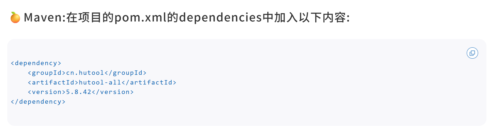
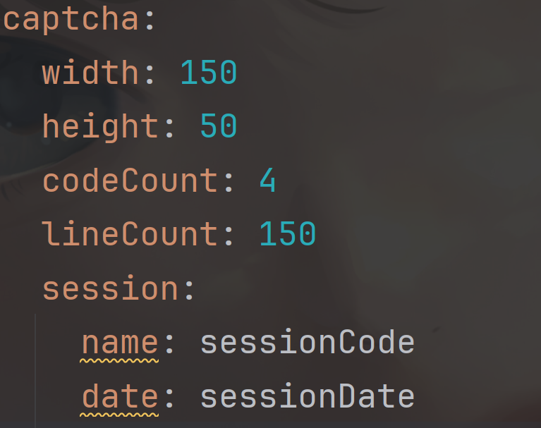

# 验证码功能

# 引入Hutool工具包

Hutool工具是一个开源的Java工具依赖库，封装了许多功能，访问`https://hutool.cn`，按图中引入依赖即可使用，具体功能可查看官方文档~



# 实现功能

以下是参考文档代码，以写出到浏览器（Servlet输出）为栗子

```java
ICaptcha captcha = ...;
captcha.write(response.getOutputStream());
//Servlet的OutputStream记得自行关闭哦！
```

# 执行流程

**==验证码的服务主要由后端实现，前端只负责发起请求，且验证码的答案一般存于内存/Redis中，这里以Hutool工具实现==**

1. 前端发起GET请求
2. 后端：

- 利用Hutool工具生成一张图片验证码
- **<u>将验证码密码放入Session / Redis 中，这里放入Session举栗子</u>**
- 加入验证条件：有效时间

3. 前端拿到图片，将用户输入一起POST到后端
4. 后端校验，返回对应的值

# 细节问题

## 线程安全

http是无状态的，后端接口之间`/captcha/getCaptcha`​与`/captcha/check`是独立的，内容无法共享数据，那需要校验的时候如何拿到验证码呢？

​`/getCaptcha`​接口的成员变量与`/check`是不共享的，以线程安全角度来说，以下两个方法都是不可取的

1. 直接声明一个成员变量

在类里声明成员变量，如果多次请求`/getCaptcha`接口，用户1生成了验证码1，用户2生成了验证码2，成员变量验证码1变化为验证码2，如果这时候用户1拿着正确的验证码1进行校验，肯定是失败的

2. 交给Spring管理

Spring管理的是Bean成员对象，且这个对象是单例的，所以也有线程安全问题

- 解决方法

**我们可以使用Session存储，Session保证了对话安全，每个用户都有单独的会话id，把验证码存储到Session中，生成与校验都能通过Session操作存入/拿出**

## 考虑线程安全问题的场景

1. 对象有没有数据共享
2. 主动创建线程（池）的时候

## 时间戳

项目开发中，时间的处理和表示通常使用时间戳，能解决跨时区的问题，实现了前后端 UI 解耦，计算也更加便捷

## 参数配置

学到Spring就要充分用到管理对象的功能，但是有些时候参数的注入过于繁琐，如需要构造一个图片类型的验证码，需要传入`width`​、`height`、验证码长度、干扰因子等等，这些固定参数通常需要放到配置文件中管理，起到解耦作用

那注入这么多参数，代码非常不美观，故又想到将配置参数转换为一个对象，从对象中去取，就更加优雅了~

举个栗子，这是构造图片验证码的代码


参数放在application.yaml文件中



由于注入的时候要一个一个取，非常麻烦，类似于：

```java
@Value("${captcha.width}")
private String width;

@Value("${captcha.height}")
private String height;

@Value("${captcha.codeCount}")
private String codeCount;

@Value("${captcha.lineCount}")
private String lineCount;
```

创建`CaptchaProperties`类来对配置对象进行管理

```java
@Component
@Data
@ConfigurationProperties(prefix = "captcha")
public class CaptchaProperties {
    private Integer width;
    private Integer height;
    private Integer codeCount;
    private Integer lineCount;
}
```

在`CaptchaController`​层面中，构造对象的时候只需注入`CaptchaProperties`对象，通过取对象中的成员得到值

```java
@Autowired
private CaptchaProperties properties;

// 定义图形验证码的长和宽
LineCaptcha captcha = CaptchaUtil.createLineCaptcha(properties.getWidth(),
    properties.getHeight(), properties.getCodeCount(), properties.getLineCount());
```

## 常量处理

开发中，管理常量的成员一般存入`constant`​包中，交给`Constant`类管理

# 实现代码

控制层

```java
@RestController
@RequestMapping("/captcha")
public class CaptchaController {
    @Autowired
    private CaptchaProperties properties;
    // 生成验证码
    @RequestMapping("/getCaptcha")
    public void getCaptcha(HttpServletResponse response, HttpSession session) throws IOException {
        // 定义图形验证码的长和宽
        LineCaptcha captcha = CaptchaUtil.createLineCaptcha(properties.getWidth(),
                properties.getHeight(), properties.getCodeCount(), properties.getLineCount());
        //告知浏览器处理响应以作为图片显示
        response.setContentType("image/jpeg");
        // 设置session (验证码内容 + 有效时间)
        session.setAttribute(properties.getSession().getName(),captcha.getCode());// 保存验证码内容
        session.setAttribute(properties.getSession().getDate(),System.currentTimeMillis());// 使用时间戳
        try {
            // 验证码写出到浏览器
            captcha.write(response.getOutputStream());
        } catch (IOException e) {
            throw new RuntimeException(e);
        }finally {
            //Servlet的OutputStream记得自行关闭
            response.getOutputStream().close();
        }
    }

    /**
     * 如何存储验证码？局部变量nonono！多线程下会修改
     * 变成对象交给Spring管理也不行，管理的Bean是单例的，多线程下也能修改
     * 把验证码存到session当中，需要用就取出来即可
     * @param captcha 用户输入的验证码
     * @return 布尔值
     */
    // 校验验证码
    @RequestMapping("/check")
    public boolean check(HttpSession session,String captcha) {
        if (!StringUtils.hasLength(captcha)) return false;
        // 获取session内的验证码
        String code = (String)session.getAttribute(properties.getSession().getName());
        // 获取验证码生成时间
        Long captchaTime = (Long)session.getAttribute(properties.getSession().getDate());
        if (!StringUtils.hasLength(code)
                || captchaTime == null) return false;
        // 校验验证码超时时间——5min 可以使用常量表示5*60*1000 常量类放到constant包中
        if (System.currentTimeMillis() - captchaTime > CAPTCHA_TIME_OUT) return false;
        return captcha.equalsIgnoreCase(code);
    }
}
```

实例层（ConfigurationProperties、Session）

```java
@Component
@Data
@ConfigurationProperties(prefix = "captcha")
public class CaptchaProperties {
    private Session session;
    private Integer width;
    private Integer height;
    private Integer codeCount;
    private Integer lineCount;
}

@Data
public class Session {
    private String name;
    private String date;
}
```

常量层

```java
public class Constant {
    public static final int CAPTCHA_TIME_OUT = 5*60*1000;
}
```

‍
